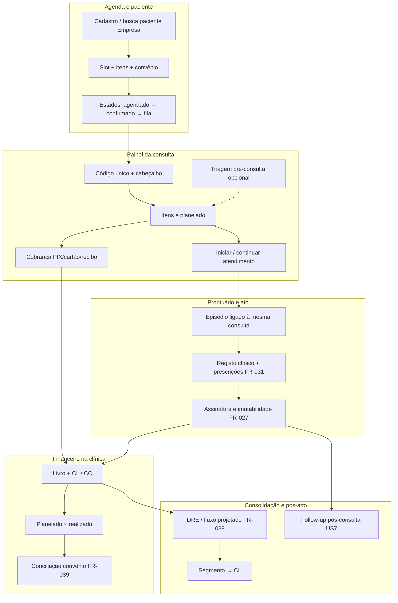
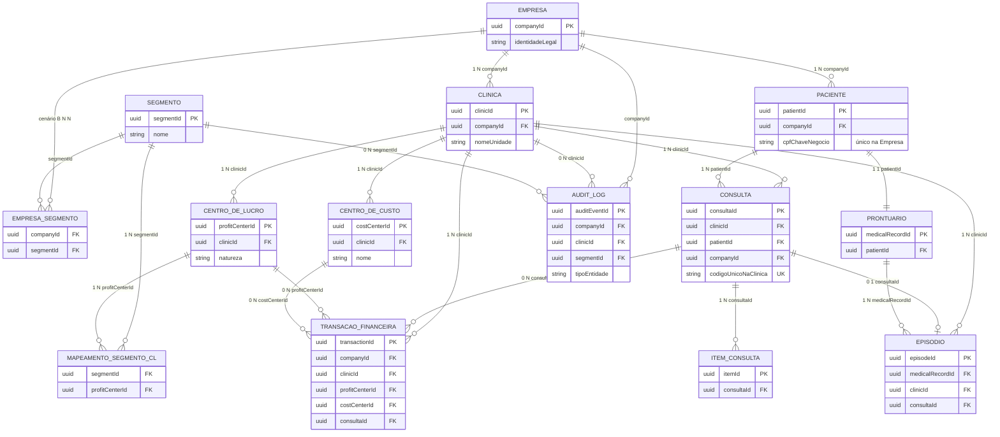

<!-- wiki-ingest: synced from specs/001-clinicagestor-platform/spec.md at 2026-05-09T17:45:44.504Z — edit upstream in monorepo, not here -->

# Feature Specification: ClinicaGestor – Plataforma integrada para clínicas

**Feature Branch**: `001-clinicagestor-platform`  
**Created**: 2026-04-11  
**Status**: Draft (polimento + stack + performance + migração + backup/DR + estratégia de testes 2026-04-11)  
**Input**: User description: "Sistema web completo de agendamento, prontuário eletrônico e gestão financeira para clínicas de saúde, multi-clínica desde o início, com RBAC dinâmico, auditoria, integrações WhatsApp e IA (agendamento, transcrição, conciliação de convênios, suporte e follow-up), fluxos de consulta com imutabilidade assinada digitalmente, e relatórios financeiros por centro de lucro."

**Nota (2026-04-29):** planos auxiliares do Cursor (`*.plan`, por vezes fora do repo) com trabalho revertido estão listados como **cancelados** em [plan.md — Planos auxiliares Cursor](./plan.md#cursor-plans-cancelled); não fazem parte do backlog normativo desta spec.

---

## 1. Visão do produto

O **ClinicaGestor** é um sistema web que integra **agenda**, **prontuário** e **financeiro** no ciclo de vida do paciente. **Onboarding e migração** de dados provenientes de **sistemas legados** (exportações em ficheiros) são tratados como **capacidade essencial de adoção**: clínicas que já operam noutro software MUST poder carregar **pacientes**, **histórico clínico** e **financeiro básico** de forma **segura, auditável e reversível por fases**, sem comprometer o isolamento **Empresa**/**clínica** (ver **User Story 9**, **§6.9**). O produto nasce **multi-clínica desde a primeira versão** com hierarquia organizacional e gerencial explícita (**Segmento → Empresa → Clínica → Centro de lucro**, ver §3) e com **cadastro de paciente e prontuário eletrônico unificados ao nível da Empresa**: a mesma pessoa (CPF, dados cadastrais, convênio, endereço, etc.) e o **mesmo dossiê clínico longitudinal** acompanham o paciente **em qualquer clínica da mesma Empresa**; cada atendimento ou episódio permanece **associado à clínica onde ocorreu** para agenda, faturação unitária e auditoria.

A **Clínica** continua a ser a **unidade operacional** (agenda, fila, lista de espera, convênio da unidade, profissionais alocados à unidade, lançamentos financeiros na unidade). A **Empresa** é a **entidade legal** que **consolida resultados** de todas as clínicas e concentra o **cadastro único de paciente** e o **prontuário compartilhado** entre as suas unidades. O **Segmento** apoia a **contabilidade gerencial** como agrupador de **centros de lucro** (por linha de negócio ou especialidade), por cima da Empresa na hierarquia de análise.

### 1.1 Fluxos Principais do Sistema *(integração entre módulos)*

O **código único da consulta na clínica** (**FR-020**, visível no **painel** — **FR-022**) é a **âncora operacional**: liga **agenda**, **cobrança**, **episódio** (**FR-026**) e **rastreio** no **livro** (**FR-036**), sempre com `companyId` + `clinicId`. O **paciente** é partilhado na **Empresa** (**FR-046**); o **centro de lucro** qualifica o financeiro e os relatórios (**FR-010**, **FR-034**).



**Pontos de integração (síntese)**

| Passo | Módulos | Ligação |
|------|---------|---------|
| **Agendamento → Painel** | Agenda → UI consulta | Duplo clique / toque no evento abre o **mesmo** registo de consulta (**FR-017**, **FR-022**). |
| **Painel → Prontuário** | Consulta → Episódio | **Iniciar atendimento** usa o **mesmo** `consultaId` / código na clínica (**FR-026**); estados de agenda e episódio **coerentes** (**FR-028**). |
| **Painel ↔ Financeiro** | Itens → recebimento | **Itens** alimentam **planejado** (**FR-023**); recebimentos no painel gravam no **livro** com **CL** (**FR-036**). |
| **Prontuário → Financeiro** | Episódio assinado | Encerramento **não** substitui lançamentos já feitos; ajustes passam por fluxos de recebimento / estorno **auditáveis**. |
| **Financeiro → Relatórios** | Livro → agregados | **Empresa** / **Segmento** / **CL** via **FR-034**, **FR-038**; **muro** do profissional (**FR-010**). |
| **Atendimento → Follow-up** | Episódio finalizado → canal | **US7**; **não** confirma novo slot sem **US2** / **FR-018**. |

**Sequência resumida (ciclo do paciente)**

1. **Agendamento** — paciente da **Empresa**, slot da **clínica**, itens e **receita planejada** (**User Story 2**, **FR-023**).  
2. **Painel da consulta** — **código único**, edições permitidas, cobrança e atalho para atendimento (**FR-022**).  
3. **Atendimento / prontuário** — episódio **âncorado** na consulta; assinatura e imutabilidade (**User Story 3**).  
4. **Recebimento financeiro** — **livro** da clínica, **CL**, confronto **planejado × realizado** (**User Story 4**, **FR-036**).  
5. **Relatórios** — **fluxo de caixa projetado**, **DRE**/rentabilidade, cortes por **Segmento** (**FR-038**).  
6. **Follow-up** — após ato concluído, mensagens com **consentimento** e **handoff** de reagendamento (**User Story 7**).

## Clarifications

### Session 2026-04-11

- **/speckit.clarify** (pedido explícito): documentados os **cinco agentes de IA** com **papel**, **limitações** e **regras de segurança**; aprofundadas **User Story 5** (suporte) e **User Story 7** (follow-up); definida **integração** entre **Agente de Transcrição** e **Agente IA de conciliação** (dados permitidos e barreiras); detalhes de implementação técnica permanecem no **plano**.
- **Triagem pré-consulta (WhatsApp)**: o **Agente WhatsApp Agendamento** MAY **estruturar** informações de saúde **voluntariamente** referidas pelo paciente num **registo de triagem simples** vinculado à **consulta**; o **painel da consulta** MUST permitir **consulta** por profissional autorizado (**FR-022**); o registo **não** substitui **episódio** nem **prontuário** (**FR-029**, **FR-030**).
- **Prescrição e pedido de exames**: **catálogo de medicamentos** com nome, dosagem, apresentação, laboratório, classificação e preço; **posologia** após seleção; **modelos** de documento personalizáveis para **impressão/PDF** ao paciente (**FR-031**, **FR-035**); **códigos de exames/procedimentos** com **TUSS** na primeira versão, **outras tabelas** no plano se necessário.

### Session 2026-04-11 (cadastro tenant e dados mestres)

- **Empresa e clínicas**: cadastro pela aplicação (`/setup/tenant` para o primeiro utilizador sem memberships; `/dashboard/settings/company` para nome da empresa e novas unidades na mesma empresa). A hierarquia **Empresa → Clínica** deixa de depender apenas do seed em ambientes operacionais.
- **Segmento e centro de lucro**: cada **centro de lucro** MUST ter um **segmento** da empresa (campo obrigatório; FK `Restrict`).
- **Centro de custo**: entidade **CostCenter** por clínica, MUST referenciar um **centro de lucro** da mesma clínica (`/dashboard/settings/cost-centers`).
- **Livro**: `LedgerEntry.segmentId` continua denormalizado a partir do CL na escritura (F2); leitura API já expõe `segment`.
- **Permissão**: `tenant.structure.manage` (módulo `tenant`) no catálogo RBAC; atribuída ao papel **gestor** via `ALL_PERMISSION_CODES`.
- **Sessão**: login permitido sem clínica para concluir o setup; `middleware` redirecciona `/dashboard` → `/setup/tenant` quando não há memberships; `session.update({ reloadClinics: true })` recarrega clínicas no JWT após criar unidade.

### Session prontuário / biblioteca de documentos (ICP) — 2026-04-26

- **Bloqueio do roteiro vs. outros documentos:** a **imutabilidade** e o **bloqueio de edição** que afectam o **conteúdo clínico do episódio** e o **PDF do roteiro** (regra alinhada a **FR-027** / **FR-033** / fluxo de `signedAt` no produto) **não** devem ser interpretados como proibição de, **noutro momento**, concluir ou iniciar a **assinatura ICP** de **outros** artefactos do mesmo episódio quando a política e o RBAC o permitirem: **prescrição** (PDF bloqueado + fluxo de assinatura paralelo conforme **ADR-0005**), **pedido externo** TUSS (PDF on-demand), e **anexos manuais** — ver **ADR-0006** (addendum 2026-04-26).
- **Descoberta unificada:** a vista agregada «Imagens e anexos do episódio» (modal + secção read-only na timeline) continua a ser o ponto único de leitura; o botão **«Assinar com certificado»** aberto a partir de **pedido externo** ou **anexo manual** refere-se **explicitamente** à assinatura ICP do **roteiro clínico** (Lacuna/VIDAAS), não ao PDF do pedido ou ao ficheiro do anexo (mensagem de ajuda no diálogo).

### Session polish (holística) — 2026-04-11

- **Consistência**: alinhamento explícito entre **User Stories 2–4**, **FR-020**–**FR-023**, **FR-026**–**FR-028**, **FR-036**–**FR-038** e **SC-001**, **SC-008**, **SC-013** (ciclo da consulta, recebimento, fluxo de caixa projetado).
- **Ciclo da consulta**: âncora única (**código da consulta na clínica**), encadeamento **agenda → painel → recebimento (opcional por fase) → livro → episódio**, coerência de estados (**FR-021**, **FR-028**).
- **Multi-plataforma**: reforço transversal em **§4**, **§2** (fecho) e ligação a **FR-012**–**FR-016**; métricas **SC-001** / **SC-008**.
- **Correções**: referência de confirmação de slot no follow-up corrigida para **User Story 2**; harmonização pontual **registo** / **registro** onde o contexto é produto em português europeu.

### Session stack (tecnologias) — 2026-04-11

- **§11** introduz **stack técnica preferida**, **integrações de referência** e regra **“preferida com liberdade”**, alinhada à **Constituição** do repositório; **FR**/**SC** permanecem critérios de produto.
- **Integrações**: NextAuth v5, Vercel AI SDK, Twilio (WhatsApp / canais de mensagem e OTP), Stripe (cartão; **PIX** e complementos BR no plano); **assinatura digital** como capacidade obrigatória sem fornecedor único na spec (**FR-033**).
- **Persistência**: PostgreSQL em produção; SQLite limitado a **desenvolvimento local** (não substitui requisitos de produção).
- **UI**: preferência explícita pela **estética e padrões dos componentes shadcn/ui** como referência de interface final (**§11.2**).

### Session performance e escala — 2026-04-11

- **FR-057**–**FR-061**: latências **P95** de referência (agenda, **painel da consulta**, relatório interativo, UI pós-importação de convênio), **escalabilidade** multi-clínica, **paginação/lazy loading**, **cache** com revalidação segura, **jobs** assíncronos para operações pesadas.
- **SC-014** / **SC-015**: baterias de teste com **≥ 90%** de cumprimento dos limiares de **FR-057** (UI core e importação de convênio).
- **§11.9**: boas práticas **Prisma**, cache e filas alinhadas a **FR-059**–**FR-061**.

### Session migração / onboarding — 2026-04-11

- **User Story 9** e **§6.9** (**FR-062**–**FR-066**): importação de **pacientes**, **histórico de prontuário** e **financeiro básico** a partir de **CSV, Excel, XML, JSON**; pipeline com **staging**, **pré-visualização**, **confirmação** e **auditoria** completa; distinto da **conciliação de convênios** (**FR-039**).
- **SC-016**–**SC-018**: volume (**1000** pacientes), **≥ 98%** qualidade em linhas válidas, **P95 ≤ 20 min** pós-confirmação (referência plano), **100%** lotes auditáveis, **0** fugas cross-tenant.

### Session diagrama de domínio — 2026-04-11

- **§3.3 Modelo de Dados Principal**: diagrama **Mermaid** `erDiagram` com entidades mínimas pedidas, chaves `companyId` / `clinicId` / `profitCenterId` / `costCenterId` / `segmentId`, tabelas de junção **EMPRESA_SEGMENTO** e **MAPEAMENTO_SEGMENTO_CL**; legenda em tabela.

### Session fluxos principais — 2026-04-11

- **§1.1 Fluxos Principais do Sistema**: `flowchart` Mermaid + tabela de **pontos de integração** + lista **1–6** (agenda → painel → prontuário → financeiro → relatórios → follow-up); **código único da consulta** como âncora (**FR-020**, **FR-022**).

### Session cadastro provisório de paciente — 2026-04-26

- **Motivação**: permitir **marcação** com **nome e contactos** quando o paciente **ainda não** existe no cadastro **Empresa**, **sem** criar duplicados prematuros na tabela definitiva de **paciente**.
- **Tabela intermédia** (`ProvisionalPatientRegistration`): MUST guardar **nome**, contactos opcionais, **código da consulta** na clínica (**número** + **id** da marcação após criação) para **correlação inequívoca** com a **consulta**; estado interno do registo provisório (ex.: pendente / cancelado) MUST ser distinto do **estado da consulta** na agenda.
- **Estado da consulta «Cadastro pendente»** (`PATIENT_REGISTRATION_PENDING` / rótulo **Cadastro pendente**): MUST ser atribuído **automaticamente** no **dia da marcação** (comparação por **data UTC** do `startsAt` face ao dia UTC corrente) quando a consulta **ainda** depende de cadastro provisório (`patientId` vazio e vínculo ao registo intermédio). A transição MUST ocorrer ao **carregar** a agenda da clínica ou o **painel da consulta** (sem obrigar job em background na primeira versão).
- **Painel da consulta**: quando o estado for **Cadastro pendente**, o sistema MUST apresentar **atalho explícito** para **concluir o cadastro** (criar o **paciente** oficial na Empresa com código interno automático, associar à consulta, passar a consulta a estado **confirmado** ou equivalente definido no plano).
- **Após concluir o cadastro**: MUST persistir o **paciente** na tabela **definitiva**; MUST **eliminar** o registo na **tabela intermédia** (não basta marcar «concluído» sem remoção). MUST manter **AuditLog** e integridade referencial (desvincular a consulta antes de apagar o provisório).
- **FR-021** (ver §6.4): o estado **Cadastro pendente** integra a máquina de estados mínima da consulta, com transições documentadas no **plano** / **tasks**.

### Session CID-10 (diagnósticos) — 2026-04-16

- **Catálogo mestre**: o sistema MUST manter um catálogo global de **diagnósticos CID-10** (fonte de referência **DATASUS**, tabela **subcategorias**), importável a partir dos **CSV** oficiais (`CID10CSV.ZIP`), **sem** duplicar por código; a gestão documenta-se em **Dados clínicos · Catálogo** (secção **Diagnósticos**).
- **Roteiro do episódio**: o campo **Diagnóstico** MUST permitir **pesquisa** por código ou texto e **inserção** da linha escolhida no texto do roteiro (ex.: `CÓDIGO — descrição`), mantendo o valor gravado como **texto clínico** editável pelo profissional.
- **RBAC / API**: pesquisa no catálogo MUST exigir sessão válida e permissão coerente com **edição da agenda / atendimento** (quem preenche o episódio); o catálogo **não** é multi-tenant por clínica na primeira versão.

### Session backup, retenção e DR — 2026-04-11

- **§6.10** (**FR-067**–**FR-071**): política de **backup** (full semanal + incremental/diferencial diário, **14** dias mínimo on-line, cópia **fora do mesmo** centro de falha, cifra, **alerta ≤ 4 h** em falha, isolamento na restauração); **retenção** por classe (**áudio**, prontuário, **AuditLog ≥ 5 anos** salvo lei maior, logs técnicos com PII); **DR** com **RPO**/**RTO** no plano, procedimento de restauração, **ensaios ≥ 1/ano**; **LGPD** (esquecimento vs retenção legal, **100%** decisões DSAR rastreáveis); **integridade** de cópias com verificação **≥ mensal** (**FR-071**).
- **SC-019** / **SC-020**: evidência de **ensaio** de restore e taxa de **sucesso** de backups em janela de **30 dias**.
- **Cruzamentos**: **FR-053** e **§11.1** referenciam **§6.10**.

### Session estratégia de testes — 2026-04-11

- **§6.11**: tipos (**unitários**, **integração**, **E2E**, **carga**, **segurança**); prioridade de cobertura (imutabilidade **FR-027**/**SC-006**, **RBAC** + muro **SC-003**/**SC-004**/**SC-011**, migração **SC-016**–**SC-018**, conciliação **FR-039**/**SC-015**, assinatura **FR-033**, multi-clínica **SC-010**/**SC-012**/**SC-013**, backup **SC-019**/**SC-020**); **TDD** SHOULD em domínio crítico; **CI** bloqueante; mapeamento **SC-001**–**SC-020** → evidência no plano; **§7** como fonte numérica.

---

## 2. Princípio: multi-clínica, Empresa, Segmento gerencial e cadastro clínico unificado

| Princípio | Significado para o produto |
|-----------|----------------------------|
| **Hierarquia gerencial** | **Segmento** (especialidade / linha de negócio) **agrupa centros de lucro** para análise; **Empresa** (entidade legal) **consolida** resultados das **Clínicas**; cada **Clínica** funciona como **centro** na segmentação gerencial; **Centro de lucro** (por **profissional**, **departamento administrativo**, **comercial** ou outra **natureza** configurável) fica **abaixo da clínica** e pode **acumular receitas e despesas** (via **centros de custo** e **rateios**, ver **FR-040**, **FR-041**) para **resultado / rentabilidade**. |
| **Empresa como agrupamento legal** | Toda **Clínica** pertence a **uma Empresa**. A Empresa consolida **financeiro** e aloja **cadastro único de paciente** e **prontuário eletrônico unificado** para todas as suas clínicas. |
| **Clínica como fronteira operacional** | **Agenda, fila de atendimento, lista de espera, slots, convênio operacional da unidade, profissionais da unidade** e **lançamentos financeiros na unidade** permanecem **escopados à clínica** (com carimbo de clínica em cada consulta/atendimento). |
| **Paciente e prontuário unificados na Empresa** | **Um** cadastro de paciente por identidade na Empresa (ex.: CPF como chave de negócio com política de deduplicação); **um** prontuário longitudinal **compartilhado** entre clínicas da mesma Empresa; episódios, prescrições e anexos **marcados** com a clínica onde foram produzidos ou válidos. |
| **Isolamento entre Empresas** | Entre **duas Empresas** (ou grupos contratuais distintos): **não** há compartilhamento de paciente, prontuário, financeiro nem agregados que identifiquem a outra parte. |
| **Isolamento operacional entre clínicas da mesma Empresa** | **Agendas e filas** não se misturam entre clínicas; **não** há “slot compartilhado” automático entre unidades. O acesso ao **prontuário unificado** entre clínicas da mesma Empresa MUST seguir **RBAC** (nem todo o perfil vê todas as unidades). |
| **Consolidação financeira na Empresa** | A Empresa MUST consolidar resultados das clínicas; relatórios MUST suportar **Segmento → Empresa → Clínica (centro) → Centro de lucro** conforme permissões. |
| **Configuração** | Papéis, permissões finas, modelos de atestado, regras de lista de espera, integrações e parâmetros de IA podem ser **por clínica** e/ou **por Empresa**; **Segmentos** e mapeamento de **centros de lucro** a segmentos são configuráveis ao nível adequado (tipicamente **Empresa**). |
| **Rastreabilidade** | Auditoria MUST incluir **Empresa**, **clínica** quando o evento for por unidade, e referência a **segmento** quando aplicável a relatórios ou alterações gerenciais. |

Estes princípios aplicam-se **transversalmente** às histórias de usuário, aos requisitos funcionais e às entidades de dados descritos nas seções seguintes. A experiência **multi-plataforma** (**§4**, **FR-012**–**FR-016**) aplica-se a **todos** os módulos com interface: agenda, **painel da consulta**, prontuário, financeiro, administração de RBAC e ecrãs de integração — com **paridade de fluxos principais** entre desktop, tablet e smartphone, salvo limitações documentadas (ex.: hardware de certificado). **Performance e escala** multi-tenant (**FR-057**–**FR-061**, **SC-014**–**SC-015**) MUST suportar o crescimento de **clínicas**, **consultas** e **utilizadores** sem degradar os fluxos críticos acima.

### 2.1 Cenários de modelo de negócio (referência explícita)

O produto MUST admitir **dois cenários** claros de implantação (detalhe de dados e telas no `/speckit.plan`):

**Cenário A — Cliente com uma única Empresa**

- Pode operar com **um único centro de lucro** que **sumariza** toda a receita/despesa de forma geral (simplicidade máxima), **ou**
- Pode definir **vários segmentos** representando tipo de negócio ou especialidade (ex.: “Odontologia”, “Medicina ocupacional”, “Exames”), com **centros de lucro** mapeados a esses segmentos para relatórios e orçamento.
- Neste cenário, **Segmento** e **Empresa** coexistem na hierarquia; a árvore completa continua `Segmento → Empresa → Clínica → Centro de lucro` (podendo existir **um** segmento “genérico” se o cliente não quiser subdividir).

**Cenário B — Cliente com mais de uma Empresa (ex.: holding, vários CNPJs)**

- As **mesmas** linhas de negócio (ex.: “Odontologia”, “Medicina ocupacional”, “Exames”) repetem-se em **cada** Empresa.
- O **Segmento** é **entidade acima da Empresa**: **o mesmo segmento** (mesmo tipo de negócio) é **compartilhado por todas as Empresas** do grupo para consolidação gerencial e relatórios **transversais ao grupo**, **sem** unificar cadastro de paciente ou prontuário entre Empresas (esses permanecem **por Empresa**).
- O cliente pode ainda optar por **um segmento agregador geral** (visão única) **e/ou** por **vários centros de lucro** por unidade que representem especialidades **dentro** de cada Empresa, mantendo o **Segmento** como camada comum acima das Empresas.

---

## 3. Hierarquia gerencial, isolamento e cadastro clínico (regras canônicas)

### 3.1 Hierarquia de contabilidade gerencial e de análise

A hierarquia **obrigatória** para segmentação e consolidação gerencial é:

```text
Segmento (especialidades / negócios — agrupa centros de lucro)
  └── Empresa (entidade legal — consolida resultados de todas as suas clínicas)
        └── Clínica (unidade operacional — trata-se como “centro” na gestão)
              └── Centro de lucro (ex.: por **profissional**, **administrativo**, **comercial** — natureza configurável)
```

- **No cenário B**, o **mesmo** nó de **Segmento** liga-se a **várias Empresas** do grupo: a consolidação “por segmento” pode **atravessar Empresas** apenas para **dados e permissões** explicitamente corporativas (ex.: financeiro agregado), **nunca** para fundir prontuário ou paciente entre CNPJs distintos.
- **Segmento**: agrupador de **centros de lucro** (atravessando **clínicas** da mesma Empresa; no cenário B, o **rótulo** de segmento é **comum** às Empresas do grupo, com agregação conforme mapeamento e RBAC).
- **Empresa**: consolidação **legal e financeira** dos resultados das clínicas; âmbito do **cadastro único de paciente** e do **prontuário unificado**.
- **Clínica**: **centro** na hierarquia gerencial; fronteira de **agenda, fila, lista de espera** e de **livro operacional** da unidade.
- **Centro de lucro**: filho da clínica; base para **resultado / rentabilidade** e, quando aplicável, para restrições de visão do **profissional** (**FR-010**). Pode representar **unidade de negócio clínica** (ex.: médico) ou **unidade gerencial** (ex.: administrativo, comercial); natureza e vínculos a **centro de custo** e **rateios** — **FR-040**, **FR-041**.

### 3.2 Regras de isolamento e de compartilhamento

As regras abaixo são **consistentes** em toda a especificação; implementação e testes devem tratá-las como invariantes de produto.

1. **Isolamento entre Empresas**: qualquer dado (cadastro, prontuário, financeiro, agregados) da **Empresa A** **não** é acessível a utilizadores ou integrações autorizados apenas para a **Empresa B**.

2. **Paciente e prontuário na mesma Empresa**: existe **um** registo mestre de paciente por identidade na Empresa (ex.: CPF com regras de unicidade e deduplicação) e **um** prontuário longitudinal; **consultas, episódios e documentos** MUST ser associados à **clínica** em que ocorreram ou em que forem válidos, mantendo o fio clínico **único** na Empresa.

3. **Escopo operacional por clínica**: criação de **slots**, **lista de espera**, **fila presencial**, **recursos da agenda** e **importação de convênio da unidade** MUST restringir-se à **clínica** correta; **não** há compartilhamento de agenda entre clínicas sem fluxo explícito (ex.: encaminhamento registrado).

4. **Escopo de leitura/escrita clínica com prontuário unificado**: o acesso a entradas do prontuário de outras clínicas da mesma Empresa MUST ser concedido **somente** quando o **RBAC** e a política de privacidade o permitirem (ex.: médico de outra unidade com permissão explícita); caso contrário, o utilizador vê apenas o permitido para a **clínica ativa** ou o subconjunto autorizado.

5. **Identificadores**: código interno de **consulta** MUST ser **único na clínica**; identificador de **paciente** no cadastro mestre MUST ser **único na Empresa** (sem duplicar CPF salvo tratamento de exceção legal/administrativa documentado).

6. **Sessão e autenticação**: o utilizador opera com **clínica ativa** (e opcionalmente contexto **Empresa** / **Segmento** para consolidação); troca de clínica MUST atualizar **agenda e operações unitárias** sem ambiguidade; **cadastro de paciente** e **linha temporal do prontuário** refletem a **mesma** identidade na Empresa.

7. **Integrações externas** (WhatsApp, pagamentos, importação): MUST resolver **Empresa** e **clínica** antes de efeitos em dados; mensagens e cobranças **não** podem ser associadas à clínica ou paciente errados.

8. **Agentes e automação** (incl. **§6.3.1**): MUST respeitar fronteira **Empresa** e, nas operações unitárias, **clínica**; **não** expor dados de outra Empresa; **não** misturar contextos de clínica em **agendamento**, **transcrição** clínica, **conciliação**, **suporte** ou **follow-up**.

9. **Profissionais e utilizadores**: vínculos **por clínica** para operação local; papéis **Empresa** / **Segmento** para consolidação e relatórios; permissões **distintas** por nível.

10. **Consolidação financeira**: totais na **Empresa** MUST conciliar com a soma (e segmentação) dos dados das **clínicas** e **centros de lucro** autorizados; relatórios MUST permitir cortes por **Segmento**, **Empresa**, **Clínica** e **Centro de lucro** conforme o modelo acima.

11. **Cenário B e dados sensíveis**: consolidação por **Segmento** envolvendo **mais de uma Empresa** MUST limitar-se a **métricas e totais** autorizados ao perfil (ex.: rentabilidade do grupo por linha de negócio); **cadastro de paciente**, **prontuário** e **documentos clínicos** **não** são agregados entre Empresas nesta especificação.

### 3.3 Modelo de Dados Principal *(diagrama de domínio)*

Visão **canónica** das entidades nucleares e respetivas chaves de **âmbito** (`companyId`, `clinicId`, `profitCenterId`, `costCenterId`, `segmentId`). O diagrama é **conceitual**: nomes físicos de tabelas, índices e campos estendidos ficam no **`/speckit.plan`**. Detalhe de **RBAC**, **Permission** e **RolePermission** permanece em **§6.2**; **migração** em **§6.9**.



**Legenda (breve)**

| Símbolo / construto | Significado |
|---------------------|-------------|
| **PK / FK** | Chave primária e chaves estrangeiras de **integridade**; toda linha operacional “pesada” carrega `companyId` e, quando for por unidade, `clinicId` (**FR-002**, **FR-046**–**FR-047**). |
| **EMPRESA → CLÍNICA** | **1:N** — cada clínica pertence a **exatamente uma** Empresa (**FR-045**). |
| **EMPRESA → PACIENTE** | **1:N** — cadastro **único na Empresa** (**FR-046**). |
| **PACIENTE → PRONTUÁRIO** | **1:1** — um **dossiê longitudinal** por paciente; `companyId` inferível via paciente (não duplicar desnecessariamente no modelo físico). |
| **EMPRESA_SEGMENTO** | **N:N** (cenário **B**): o mesmo **Segmento** pode ligar-se a várias Empresas do grupo **sem** fundir paciente/prontuário (**§2.1**, **§3.2 item 11**). No cenário **A**, o vínculo pode colapsar-se a **um** segmento genérico por Empresa no plano. |
| **CLÍNICA → CENTRO_DE_LUCRO / CENTRO_DE_CUSTO** | **1:N** — CL e CC são **filhos da clínica** (**FR-034**, **FR-035**). |
| **MAPEAMENTO_SEGMENTO_CL** | **N:N** — **Segmento** agrupa **centros de lucro** via mapeamento explícito (**FR-034**); **não** substitui a hierarquia física Clínica → CL. |
| **CONSULTA** | **N:1** Paciente, **N:1** Clínica; `codigoUnicoNaClinica` **único por clínica** (**FR-020**). |
| **ITEM_CONSULTA** | **N:1** Consulta — linhas de serviço / valores planejados (**FR-022**, **FR-023**). |
| **EPISÓDIO** | **N:1** Prontuário, **N:1** Clínica; **0..1** Consulta (âncora do ato) (**FR-026**). |
| **TRANSAÇÃO_FINANCEIRA** | **N:1** Clínica e **N:1** `profitCenterId` quando aplicável; `costCenterId` e `consultaId` **opcionais**; **Segmento** em relatórios obtém-se pelo **mapeamento** CL↔Segmento (**FR-034**, **FR-036**), não obrigando FK directo na transação. |
| **AUDIT_LOG** | Eventos com `companyId` **obrigatório**; `clinicId` e `segmentId` **quando aplicável** (**FR-005**, **FR-051**). |

---

## 4. Experiência: interface responsiva e multi-plataforma

O sistema **MUST** ser entregue como **aplicação web** utilizável de forma **equivalente em valor funcional** em **desktop**, **tablet** e **smartphone** (navegadores modernos nas plataformas suportadas na fase de plano). A **stack front-end preferida** (ex.: Next.js, React, Tailwind, shadcn/ui) está em **§11.2**; a **identidade de componentes** (look-and-feel dos controlos, tabelas, diálogos, formulários) SHOULD seguir por defeito o **catálogo shadcn/ui** como referência de interface final, salvo exceção justificada no plano. Os requisitos abaixo são **comportamentais** e aplicam-se independentemente da biblioteca.

**Requisitos de experiência:**

- **Layout responsivo**: grids, calendário, tabelas financeiras, formulários de prontuário e painéis **MUST** reorganizar-se por largura de viewport (breakpoints), mantendo fluxos principais acessíveis sem exigir deslocamento horizontal excessivo.
- **Interação multi-plataforma**: controles **MUST** ser adequados a **mouse/teclado** e a **toque** (alvos tocáveis, gestos de scroll nativos), inclusive na agenda e em listas densas.
- **Navegação**: estrutura principal (ex.: barra lateral ou equivalente) **MUST** colapsar ou converter-se em padrão móvel (menu empilhável, abas ou drawer) sem ocultar módulos obrigatórios sem caminho explícito de retorno.
- **Paridade de capacidades**: não há “apenas desktop” para funções core de agendamento, atendimento, prontuário (exceto ações que dependam de hardware específico, ex.: certificado físico) e consulta financeira dentro do escopo do papel do utilizador; adapta-se o **layout**, não a **existência** da capacidade.
- **Desempenho percebido**: estados de carregamento (ex.: esqueletos) **MUST** ser visíveis nas transições principais em todas as classes de dispositivo.

Os requisitos normativos de layout, toque, teclado, tema e feedback (**FR-012**–**FR-016**) detalham o que aqui se resume; **SC-001** (tempo de agendamento) e **SC-008** (painel da consulta em smartphone) servem de **prova mensurável** de paridade operacional.

---

## 5. User Scenarios & Testing *(mandatory)*

### User Story 1 - Autenticação forte, isolamento multi-clínica / multi-Empresa e muro financeiro por Centro de Lucro (Priority: P1)

O sistema identifica inequivocamente o **utilizador**, a **Empresa** e a **clínica ativa** (quando a operação for unitária) antes de qualquer dado sensível. Após **autenticação com segundo fator obrigatório**, um **gestor de unidade** opera **só** na clínica escolhida e configura **papéis e matriz Permission + RolePermission** **daquela** clínica através de **ecrãs objetivos, intuitivos e autoexplicativos** (sem depender de documentação técnica externa como passo obrigatório), sem propagar efeitos a outras unidades. Um **gestor corporativo** acessa **vistas consolidadas** e, **se** o RBAC permitir, ao **cadastro e prontuário unificados** na **Empresa** — **nunca** misturando dados de **outra Empresa**.

Um **profissional** na clínica A com vínculo ao **centro de lucro X** está sujeito ao **muro financeiro**: em **qualquer** tela, exportação, API ou relatório de natureza financeira (receitas, despesas, extratos, rentabilidade, comparativos), o sistema **só** devolve linhas e totais **atribuíveis ao centro de lucro X** na **clínica ativa A** — **não** vê totais de colegas (outros centros de lucro na mesma clínica), **não** vê financeiro de **outra clínica** e **não** contorna o muro por agregações “inteligentes” ou drill-down não autorizado. **Dados clínicos** de outra unidade B da mesma Empresa **só** aparecem se o RBAC do prontuário unificado **explicitamente** o permitir.

**Why this priority**: Autenticação, isolamento organizacional e confidencialidade financeira entre profissionais são **requisitos de segurança, LGPD e confiança**; falhas aqui invalidam o produto.

**Independent Test**: (1) Duas **Empresas** E1/E2 e utilizador só em E1: comprovar **zero** fuga para E2 em UI, URLs, APIs, exportações e agentes. (2) Duas **clínicas** A/B na mesma Empresa, dois **profissionais** com centros de lucro distintos na mesma clínica: comprovar muro financeiro (incl. tentativa de inferência por subtração de totais da clínica). (3) Troca de **clínica ativa**: comprovar ausência de dados residuais da clínica anterior.

**Acceptance Scenarios**:

1. **Given** utilizador válido vinculado **apenas** à clínica A (Empresa E), **When** completa senha + segundo fator, **Then** a sessão fica vinculada a **E** e **clínica A** e **toda** resposta da aplicação para operações unitárias está no âmbito **A**; tentativas de acesso com identificadores de **B** ou de **outra Empresa** são **negadas** e **registadas em AuditLog** quando envolvam recurso sensível.
2. **Given** utilizador autorizado em **A** e **B** (mesma Empresa), **When** alterna a clínica ativa de A para B, **Then** a UI e caches de cliente **não** exibem nem reutilizam dados operacionais de A; **When** volta para A, **Then** o mesmo vale em relação a B.
3. **Given** profissional na clínica A **só** no centro de lucro **X**, **When** abre painéis financeiros, exporta relatório ou chama API equivalente, **Then** **só** vê valores e movimentos **alocados a X** em **A**; **When** tenta filtro ou identificador de centro **Y** ou de **outra clínica**, **Then** resultado é **vazio** ou **erro de autorização**, sem mensagem que revele existência de montantes de terceiros.
4. **Given** gestor na clínica A, **When** altera **RolePermission** de um **papel** (liga ou desliga uma **Permission**), **Then** a alteração aplica-se **somente** aos utilizadores com esse **papel** em **A**; utilizadores com homónimo de papel em **B** **não** são alterados; a alteração gera **AuditLog** com valores anterior/novo conforme política.
5. **Given** gestor corporativo da **Empresa** com clínicas A e B, **When** consolida indicadores, **Then** **não** inclui dados de **outra Empresa**; **When** abre cadastro/prontuário unificado **sem** permissão cross-unidade, **Then** o acesso a episódios de **B** permanece **bloqueado**; **When** com permissão, **Then** vê histórico **marcado por clínica** e cada visualização sensível pode gerar **AuditLog** de leitura conforme configuração da clínica/Empresa.
6. **Given** política LGPD de **auditoria de leitura** ativada para prontuário, **When** utilizador autorizado abre dossiê de paciente, **Then** existe registro em **AuditLog** com **quem**, **quando**, **qual** âmbito (**Empresa**/clínica) e **qual** recurso acessado, sem alterar o conteúdo clínico.
7. **Given** gestor com permissão de administrar RBAC na **clínica A**, **When** abre a configuração de um **papel** (base ou personalizado), **Then** a UI indica **inequivocamente** o âmbito (**A**), agrupa capacidades por **área funcional** e mostra **rótulos em linguagem de negócio** com texto de ajuda; **When** altera uma capacidade **sensível** (ex.: gestão de RBAC, exportação de dados, visão cross-unidade), **Then** o sistema exige **confirmação explícita** e, após guardar, apresenta **estado ou resumo** que permita validar o que o papel permite **sem** jargão interno obrigatório.

---

### User Story 2 - Agenda unificada por profissional e por clínica (Priority: P1)

Na **clínica ativa**, o ciclo da **consulta** (ou ato equivalente na agenda) percorre, de forma contínua e auditável, desde a **captura da intenção** até o **painel detalhado** aberto no calendário:

1. **Agendamento**: o **atendente** (ou o **Agente WhatsApp Agendamento**, ver §6.4) escolhe **profissional**, **tipo de ato** (consulta, procedimento, cirurgia ou equivalente configurado pela clínica), **duração** (respeitando regras do profissional), **convênio ou particular**, **data/hora** em **slot válido só da clínica ativa** e **linha de itens** (código, descrição, quantidade, valor planejado). O **paciente** vem do **cadastro único da Empresa** (busca por CPF, nome ou telefone) ou é criado com **dados mínimos** e **consentimento** conforme política — **sem** duplicar identidade na Empresa. Quando o agendamento decorrer por **WhatsApp** e o paciente **voluntariamente** referir motivo de consulta, sintomas, alergias, medicações ou outros dados de saúde **relevantes à triagem administrativa**, o **Agente WhatsApp Agendamento** MAY **aproveitar** a conversa para preencher ou sugerir um **registo de triagem simples** (campos **limitados** e **configuráveis** pela clínica, ver §6.4), **vinculado à consulta** — **não** confundir com **episódio** de prontuário; o **profissional** consulta-o no **painel da consulta** ao abrir o evento (**FR-022**).
2. **Confirmação e lembretes**: o estado evolui (ex.: agendado → confirmado) por ação interna, resposta do paciente no WhatsApp ou política da clínica; o sistema regista **quem** confirmou e **quando**. **Lembrete por WhatsApp** pode ser agendado ou reenviado a partir do painel, respeitando **opt-in**, **horário comercial** e **templates** da clínica.
3. **Dia do ato**: chegada, fila e estados operacionais (ex.: aguardando, em atendimento) permanecem **no âmbito da clínica**; alterações refletem-se no **mesmo** evento da agenda.
4. **Painel da consulta (duplo clique ou ação equivalente)**: ao abrir o evento, o utilizador autorizado vê um **painel modal** (popup) **rico e objetivo** com **código único da consulta na clínica** (visível, copiável e presente em recibo/comunicações quando aplicável), **cabeçalho** com **tipo de ato** e **estado** atual, **coloração ou padrão visual diferenciado por tipo** (com **legenda** e acessibilidade **não** dependente só de cor), **paciente** (ligação ao cadastro Empresa), **profissional**, **horários**, **convênio/particular**, **tabela de itens** com totais, **secção de pagamento** (status, **PIX**, **cartão**, **recibo**), **secção de triagem pré-consulta** quando existir registo vinculado (origem conversa WhatsApp ou edição pelo atendente; **rótulo** claro de que é **informação declarada / não validada clinicamente** no canal de agendamento), controlo de **lembrete WhatsApp**, **edição** de campos permitidos pelo RBAC (com validação e **AuditLog** em alterações relevantes) e atalho para **nota fiscal** externa quando a clínica estiver integrada.

Cancelamentos e vagas libertadas alimentam a **lista de espera da mesma clínica**; reagendamentos criam novo vínculo de slot **sem** cruzar fronteira para outra unidade.

**Encadeamento operacional e financeiro:** O **mesmo** identificador de consulta na clínica (**FR-020**) funciona como **âncora** entre **agenda**, **painel da consulta** (**FR-022**), **recebimentos** registados na secção de cobrança (**FR-036**), **livro** da unidade, confronto **planejado × realizado** (**FR-023**, **User Story 4**) e, quando autorizado, **Iniciar / continuar atendimento** até ao episódio (**FR-026**). O recebimento pode ocorrer **antes**, **durante** ou **após** o ato conforme política da clínica; em qualquer ordem permitida, os lançamentos MUST permanecer **vinculados** à consulta e ao **centro de lucro** (e **segmento** derivado quando aplicável), com **recibo** ou conjunto de comprovativos coerentes com o livro (**FR-037**).

**Why this priority**: Agenda é o hub operacional; slots e filas permanecem **por unidade**, o cadastro evita duplicidade na Empresa, e o **painel da consulta** concentra cobrança, comunicação e edição segura num único fluxo fluido.

**Independent Test**: Na clínica A, percorrer o ciclo completo (agendar → confirmar → abrir painel por duplo clique → registar pagamento simulado → enviar lembrete) com paciente já existente na Empresa (cadastrado antes em B); comprovar **um** cadastro, **slots** disjuntos entre A e B e **código único** da consulta **só** interpretável no contexto de A.

**Acceptance Scenarios**:

1. **Given** disponibilidade de um profissional **da clínica A**, **When** o atendente cria agendamento com itens e valores planejados para um paciente já registrado na Empresa em outra clínica, **Then** o evento aparece no calendário **em A** com **tipo** e **estado** visíveis e **cor ou padrão** distinto dos outros tipos (conforme legenda), reutiliza o **mesmo** registro de paciente da Empresa e gera receita planejada **no financeiro de A**.
2. **Given** lista de espera e cancelamento **na clínica A**, **When** ocorre encaixe automático, **Then** apenas candidatos elegíveis **para a agenda de A** são considerados; a fila de A **não** consome slots de B.
3. **Given** paciente no WhatsApp da **clínica A**, **When** pede orientação clínica ou diagnóstico, **Then** o **Agente WhatsApp Agendamento** recusa **conselho médico** e oferece apenas **agendamento, informação de horário ou encaminhamento humano**; permanece limitado a **Empresa** e **clínica A** resolvidas pelo canal.
4. **Given** uma consulta **em A**, **When** utilizador autorizado faz **duplo clique** (ou abre ação equivalente em toque), **Then** o painel modal exibe **código único na clínica**, **status**, **itens**, **secção de cobrança** (PIX, cartão, recibo conforme permissão), **secção de triagem pré-consulta** quando existir registo, estado do **lembrete WhatsApp** e **edição** guardável sem fechar o contexto da clínica; **When** o mesmo utilizador observa a agenda **em B**, **Then** o painel de A **não** é confundido com eventos de B (âmbito explícito na UI).
5. **Given** agendamento criado via **Agente WhatsApp Agendamento** na clínica A, **When** o paciente confirma data e hora propostas com texto inequívoco, **Then** o sistema só grava após **confirmação explícita** de resumo (data, hora, profissional, tipo) e deixa **AuditLog** com origem integração; **When** a mensagem é ambígua ou conflituosa com slots, **Then** o agente **não** cria compromisso e pede clarificação ou **escalona** para atendente.
6. **Given** consulta em estado **confirmado**, **When** o atendente dispara **lembrete WhatsApp** a partir do painel, **Then** o envio respeita política de consentimento e regista tentativa/resultado consultável; **When** o paciente não tem opt-in válido, **Then** a ação é **bloqueada** com mensagem clara ao utilizador interno.
7. **Given** agendamento via **Agente WhatsApp Agendamento** em que o paciente descreve **motivo** ou **sintomas** em mensagem livre, **When** a política da clínica permite triagem assistida, **Then** o sistema gera ou atualiza **registo de triagem simples** ligado à **consulta** com campos configurados (ex.: motivo da consulta, urgência percebida **não clínica**, alergias referidas) e **marcador** de origem **WhatsApp**; **When** o **profissional** autorizado abre o **painel da consulta**, **Then** vê a **secção de triagem pré-consulta** com o mesmo conteúdo e o aviso de **não validação clínica**; **When** o paciente **não** forneziu informação de saúde, **Then** a secção pode estar **vazia** ou **oculta** conforme configuração.
8. **Given** registo de triagem preenchido por IA, **When** o atendente **corrige** campos no painel antes da consulta, **Then** alterações geram **AuditLog** e preservam rastreio de **versão** ou **autor da última edição** conforme plano.

---

### User Story 3 - Prontuário unificado na Empresa, atendimento por clínica e imutabilidade (Priority: P1)

No contexto da **clínica ativa**, o **profissional** percorre um **ciclo clínico completo** ligado à **mesma consulta** da agenda (**código único na clínica**, ver **User Story 2** e **FR-022**), desde o início do atendimento até o **bloqueio irreversível** do episódio:

1. **Iniciar consulta**: a partir da consulta elegível (estado na fila/agenda conforme política), o profissional **inicia o atendimento**; o sistema associa o episódio ao **paciente** no cadastro **Empresa**, à **clínica ativa** e à **consulta**, regista **ator** e **carimbo de tempo** e coloca o evento nos estados operacionais da **unidade** (ex.: em atendimento).
2. **Timer**: o **cronómetro** do ato corre **no contexto dessa consulta** (início, pausas se permitidas pela clínica, retomação, paragem ao encerrar); duração e marcos MUST poder integrar **AuditLog** e relatórios operacionais **sem** alterar o conteúdo clínico por si só.
3. **Registo clínico estruturado**: durante o atendimento, o profissional preenche (ou revisa propostas da IA) os **campos estruturados** do prontuário (**FR-029**) com **editor rico** onde aplicável (**FR-030**), anexa arquivos quando necessário (**FR-032**) e utiliza **prescrições** (medicamentos do **catálogo** com **posologia** editável, **FR-031**), **solicitações de exames** e **documentos** gerados a partir de **modelos personalizáveis** para **impressão e entrega ao paciente** (**FR-031**), além de atestados; o conteúdo gravado no episódio atual vive no **prontuário longitudinal** da Empresa com **marcador de clínica** e respeito a **RBAC** para leituras de outras unidades.
4. **Transcrição assistida**: com **consentimento** e política da clínica, o profissional pode **gravar áudio** da entrevista; o **Agente de Transcrição** (ver §6.5) gera **propostas** mapeadas para os campos corretos (queixa, antecedentes, alergias, hábitos, exame, conduta, etc.); **nenhum** texto clínico entra no prontuário definitivo **sem** **revisão e aceitação humana** explícita.
5. **Encerramento e assinatura digital**: ao concluir, o profissional **assina digitalmente** (ou equivalente de não repúdio, **FR-033**) o **episódio** (ou bloco definido no plano); o sistema valida **requisitos mínimos** configuráveis (ex.: campos obrigatórios) antes de aceitar a assinatura.
6. **Imutabilidade**: após assinatura **válida**, o **episódio assinado** torna-se **imutável de forma irreversível** no produto (**FR-027**): edição direta dos campos bloqueados **não** é permitida a utilizadores de negócio; correções posteriores, se existirem na política da clínica, MUST seguir fluxo de **adendo** ou documento **novo** também assinado e auditado, **sem** apagar ou alterar o conteúdo já assinado.

O evento na **agenda** da **mesma clínica** MUST refletir o estado final (ex.: atendido / finalizado) em coerência com **FR-028**.

**Why this priority**: Continuidade clínica na rede exige **um** dossiê; responsabilidade, segurança jurídica e LGPD exigem **carimbo de clínica**, **trilha de auditoria** e **bloqueio pós-assinatura** inequívoco.

**Independent Test**: (1) Na clínica A, percorrer **Iniciar consulta → timer → preenchimento (incl. proposta de transcrição rejeitada e aceite) → prescrição com medicamento do catálogo e posologia editada → documento com modelo personalizado (PDF/impressão) → assinatura → tentativa de edição bloqueada**. (2) Paciente atendido em B; em A, profissional **com** RBAC vê episódio de B marcado por clínica; **sem** RBAC **não** vê.

**Acceptance Scenarios**:

1. **Given** consulta elegível **na clínica ativa**, **When** o profissional **inicia atendimento**, **Then** o episódio liga-se à **consulta** e ao **paciente** da Empresa, o **timer** inicia (ou fica disponível conforme política) e os estados da **fila/agenda** aplicam-se **só** à unidade; **AuditLog** regista o início com **Empresa** e **clínica**.
2. **Given** atendimento em curso, **When** o profissional **pausa** ou **retoma** o timer (se a clínica permitir), **Then** os marcos ficam registados e o conteúdo clínico **não** é alterado automaticamente pela pausa.
3. **Given** fluxo concluído com **assinatura digital válida**, **When** o sistema aplica imutabilidade, **Then** o **episódio** (ou unidade de bloqueio do plano) **não** aceita edição nem eliminação por utilizadores de negócio; **When** política da clínica exige **adendo**, **Then** o adendo é **novo** registro assinável, **sem** modificar o texto do episódio original (política de adendo no plano).
4. **Given** áudio gravado com consentimento na clínica A, **When** o **Agente de Transcrição** processa o diálogo médico–paciente, **Then** as **propostas** aparecem **por campo estruturado** (ex.: alergias vs queixa) com indicação de **origem** (áudio/trecho ou intervalo temporal); **When** o profissional **rejeita** uma proposta, **Then** **nada** é gravado nesse campo a partir dessa proposta; **When** **aceita** (global ou por campo), **Then** o valor passa ao prontuário como **entrada humana confirmada** e fica sujeito às mesmas regras de gravação/auditoria que edição manual.
5. **Given** episódio **assinado** e imutável, **When** utilizador com papel clínico tenta alterar campo bloqueado, **Then** a operação é **negada** com mensagem clara; **When** administrador técnico existe no plano, **Then** qualquer **exceção** (“break-glass”) MUST ser **raríssima**, **auditada** e **fora** do fluxo normal de negócio (detalhe no plano), **sem** contradizer a imutabilidade para utilizadores clínicos.
6. **Given** consulta finalizada na clínica A, **When** a agenda é atualizada, **Then** o estado do evento na **clínica A** reflete **conclusão** coerente com o episódio (**FR-028**).
7. **Given** catálogo de medicamentos em A com campos **nome, dosagem, apresentação, laboratório, classificação e preço**, **When** o profissional **pesquisa** e **seleciona** um medicamento para prescrever, **Then** a lista de resultados MUST exibir esses atributos e, após a seleção, MUST abrir o campo de **posologia** com **recomendação** editável pelo médico antes de gravar a linha.
8. **Given** modelo de documento **“prescrição + solicitação de exames”** configurado em A, **When** o médico escolhe **dois** medicamentos com posologia e **três** exames do catálogo e gera o documento, **Then** o **preview** e o **PDF** (ou equivalente) MUST incorporar os itens nos **placeholders** do modelo, com dados da clínica e do profissional, e MUST permitir **impressão** para entrega ao paciente.
9. **Given** política da clínica **sem** exibir preço ao paciente no papel, **When** o mesmo modelo é gerado, **Then** o **preço** **não** aparece no documento final **mesmo** existindo no catálogo interno.
10. **Given** catálogo de exames com entradas **TUSS** (código + descrição), **When** o médico pesquisa por **código** ou **fragmento** da descrição, **Then** o sistema MUST devolver itens correspondentes e, ao incluir no pedido e **gerar** o documento, **Then** o **código TUSS** e a **descrição** MUST aparecer no **preview** e no **PDF** conforme o modelo.

---

### User Story 4 - Financeiro, hierarquia Segmento → Empresa → Clínica → Centro de lucro (Priority: P2)

O fluxo financeiro **por clínica** liga **planejado** (receita esperada a partir da agenda, itens da consulta e **preços planejados** cadastrados, **FR-023**, **FR-035**) ao **realizado** no **livro da unidade** (pagamentos e liquidações), com **rastreabilidade** até **centro de lucro**, **centro de custo** (despesas) e **segmento** gerencial. Na **visão agregada no tempo**, o produto MUST apresentar **um único fluxo de caixa projetado** — linha temporal que **unifica** o que já ocorreu no livro com o que ainda está apenas planeado (**FR-038**), **sem** tratar “fluxo real” e “fluxo planejado” como **dois** eixos ou relatórios paralelos de caixa.

**Fluxo de recebimento (painel → livro):** A receção de valores faz-se tipicamente a partir da **secção de cobrança** do **painel da consulta** (**FR-022**): o operador regista **um ou vários** movimentos (meio único ou **híbrido**), confirma **soma** e coerência face ao **planejado** quando existir, e emite ou consulta **recibo** / comprovativos conforme **FR-037**; cada parcela integra o **livro** com **centro de lucro** e contribuição analítica ao **segmento** quando mapeado (**FR-036**, **FR-034**). **Estornos** e ajustes MUST manter **rasto** auditável sem apagar o histórico do planejamento original (**FR-005**, **FR-036**). O mesmo fluxo MUST ser **concluível em smartphone** quando o papel o permitir (**FR-013**, **SC-008**).

1. **Planejado × realizado** (nível de **consulta / recebimento**): cada **consulta** na **clínica ativa** pode carregar **valores planejados** por item (particular ou convênio); ao receber, o sistema **confronta** planejado com **valores efetivos** (total ou por parcela), expõe **variação** (ex.: desconto, taxa, glosa) e mantém o vínculo ao **mesmo** evento e **paciente** da Empresa — **distinto** da composição temporal do **fluxo de caixa projetado** agregado (**FR-038**).
2. **Meios de pagamento**: o operador registra recebimentos em **dinheiro**, **cartão** (crédito/débito), **PIX**, **convênio** (faturamento direto ou repasse posterior) ou **híbrido** — **divisão explícita** entre meios (percentual ou valores) com **soma coerente** ao total do ato ou parcela; **todos** os lançamentos ficam no **livro da clínica** com **centro de lucro** e, quando aplicável, **centro de custo** em **despesas** e contribuição analítica ao **segmento** via mapeamento **centro de lucro → segmento(s)**.
3. **Conciliação de convênios**: arquivos ou extratos da operadora são **importados por clínica**; o **Agente IA de conciliação** (ver §6.6) propõe **correspondências** entre linhas do arquivo e **consultas/itens** internos, usando o **cadastro único de paciente** da Empresa e regras da unidade; o **utilizador** valida ou corrige; **inconsistências** (valor divergente, duplicidade, paciente não encontrado, procedimento não casado) ficam num **log consultável e exportável** **no tenant da clínica**, com possibilidade de **resolver** ou **justificar** com **AuditLog**.
4. **Despesas por centro de custo e espelhamento em centros de lucro**: despesas operacionais e administrativas MUST ser **classificadas** com **centro de custo** quando a política da clínica o exigir (tipos configuráveis). Cada **centro de custo** MUST poder **vincular-se** a um ou mais **centros de lucro** para **espelhamento**: ao lançar despesa no **CC**, o sistema gera **parcelas analíticas** (valores espelhados) nos **CL** vinculados, permitindo que o **mesmo** centro de lucro acumule **receitas** (ex.: consultas do médico) e **parcela de despesas** (ex.: administrativo ou energia alocada) para **resultado / rentabilidade** (**FR-040**, **FR-038**).
5. **Centros de lucro por natureza**: além dos **CL por profissional**, o cadastro MUST permitir **CL departamentais ou gerenciais** (ex.: **administrativo**, **comercial**, **genérico/pool**) com **classificação de natureza** estável para relatórios e **RBAC**; estes CL servem como **destino** ou **origem** de **rateios** e como **nó** de custos indiretos espelhados desde **CC** (**FR-040**).
6. **Rateio** (**sem cruzamento** entre CC e CL): o gestor configura **dois** tipos de rateio **independentes**: (a) **Centro de custo emissor → centros de custo receptores** — só **CC** para **CC** (ex.: **CC** indireto → vários **CC** departamentais), para distribuir **gastos** lançados no **emissor**; (b) **Centro de lucro origem → centros de lucro destino** — só **CL** para **CL** (ex.: **CL** administrativo/pool → **CLs** de médicos). É **proibido** **rateio cruzado** (**CL→CC**, **CC→CL** ou execução mista **CL+CC**); a **ligação** entre camadas de **CC** e **CL** dá-se **apenas** pelo **espelhamento** configurável (**FR-040**), não por rateio. Cada execução MUST ser **auditável**, com **soma** das parcelas **reconciliável** com a origem e **sem** dupla contagem indevida com o **espelhamento** (**FR-041**).
7. **Consolidação e relatórios**: o **gestor corporativo** obtém **DRE / resultado**, **rentabilidade** e **fluxo de caixa projetado** (linha temporal unificada, **FR-038**) com cortes por **Segmento** (agregando **apenas** os **centros de lucro** mapeados àquele segmento), **Empresa**, **clínica** e **centro de lucro**, incluindo **receitas**, **despesas espelhadas** (CC→CL) e **efeitos de rateio CL→CL** quando ativos, **sem** perder a linha de lançamento na unidade e **sem** dupla contagem indevida entre segmentos (**FR-034**, **FR-038**, **FR-040**, **FR-041**).
8. **Composição temporal do fluxo projetado** (referência **D** = dia atual no fuso da clínica ou equivalente no plano): **antes de D**, a série MUST refletir **valores realizados** de receitas e despesas conforme o **livro**; **depois de D**, MUST incorporar apenas **planejado** — receitas esperadas de **consultas, procedimentos e cirurgias** com base na agenda e em **preços planejados** cadastrados, e **despesas a pagar** ao longo do tempo (contas a pagar / compromissos conforme política no plano); **em D**, MUST ser **híbrida**: ao longo do dia, à medida que receitas e despesas planeadas se concretizam, o sistema MUST **atualizar estado** e **regularizar** montantes para o **real** recebido ou dispendido, mantendo **uma** linha coerente (**FR-038**).

**Why this priority**: A entidade legal consolida caixa e **resultado**; a **segmentação gerencial** exige **Segmento** como agregador de **centros de lucro** de **várias naturezas**; **CC → CL espelhado** e **rateios** são padrão em clínicas médias para custos indiretos e **rentabilidade** por linha de negócio ou por profissional.

**Independent Test**: Duas clínicas na mesma Empresa com CLs **profissionais** e **CL administrativo**, **CC** com vínculo de espelhamento para CLs, uma **execução de rateio** (ex.: energia) do CL administrativo para CLs de médicos e outra **CC→CC** (indiretos → departamentos), despesas com **CC** distintos, recebimento **híbrido** e arquivo de convênio **parcialmente** casado: comprovar **reconciliação** Empresa/segmento/clínica, **log** de inconsistências só em **A**, **resultado por CL** coerente com receitas + espelhos + rateios, **soma** do rateio = origem, e **fluxo de caixa projetado** com regra temporal **antes de D, em D e depois de D** (**FR-038**) **sem** duas séries paralelas de caixa.

**Acceptance Scenarios**:

1. **Given** recebimento **híbrido** (ex.: parte PIX e parte cartão) **na clínica A**, **When** confirmado, **Then** o livro **de A** registra **duas** parcelas (ou estrutura equivalente) que **somam** o total, cada uma com meio correto, **centro de lucro** e, quando aplicável, **segmento** derivado do mapeamento do CL; **não** há lançamento em **B**.
2. **Given** consulta com itens **planejados** em A, **When** o recebimento real difere do planejado (desconto ou acréscimo), **Then** a UI e relatórios **mostram** planejado, realizado e **variação** ligados à **mesma** consulta; **AuditLog** registra alteração relevante quando o utilizador ajusta valores.
3. **Given** arquivo de convênio importado para **A**, **When** o **Agente IA de conciliação** propõe correspondências, **Then** o utilizador pode **aceitar**, **rejeitar** ou **editar** o match antes de consolidar; **When** há linha sem correspondência segura, **Then** entra no **log de inconsistências** com **motivo** e **não** altera dados clínicos nem financeiros de outra clínica; matching usa **paciente** da **Empresa** + contexto **A**.
4. **Given** despesa operacional em A com tipo que exige **centro de custo**, **When** o utilizador tenta gravar **sem** centro de custo, **Then** o sistema **bloqueia** ou exige confirmação conforme política; **When** gravada com CC, **Then** aparece nos relatórios por **centro de custo** e no **rollup** da Empresa autorizado ao perfil.
5. **Given** gestor com permissão na **Empresa**, **When** exporta **rentabilidade** e **fluxo de caixa projetado** por **Segmento** e por **clínica**, **Then** o **Segmento** agrega **somente** os **centros de lucro** mapeados a esse segmento (definição configurável); o arquivo **não** inclui dados de **outra** Empresa; totais por segmento **reconciliam** com a soma dos CLs autorizados na definição.
6. **Given** importação com **duas** linhas conflituosas para a mesma consulta, **When** o utilizador resolve uma e marca a outra como duplicada, **Then** o **log** atualiza estado da inconsistência e o **AuditLog** registra a resolução **em A**.
7. **Given** **CC “Energia”** vinculado ao **CL administrativo** e aos **CLs** de dois médicos em A, **When** lança despesa no **CC Energia**, **Then** o **CL administrativo** (e/ou os CLs conforme regra de espelhamento) recebe **parcelas espelhadas** consultáveis; **When** executa **rateio** do saldo administrativo para os dois CLs médicos com chave **50/50**, **Then** cada CL médico recebe **metade** auditável e a **soma** das parcelas **fecha** a origem.
8. **Given** relatório de **resultado por CL** na clínica A, **When** o gestor filtra um **CL médico**, **Then** vê **receitas** daquele CL, **despesas** via espelho/rateio **atribuídas** a ele e **margem**; **When** filtra **CL administrativo**, **Then** vê acumulados conforme **RBAC** e **não** vê dados de **B**.
9. **Given** **CC “Indiretos”** em A e três **CC** departamentais, **When** executa **rateio CC → CC** de um valor do **CC Indiretos** para os três com chaves **40/30/30**, **Then** cada **CC** destino recebe parcela **auditável** e a **soma** **fecha** a origem; **When** abre relatório por **CC** departamental, **Then** vê lançamentos diretos **e** parcelas de **rateio** recebidas.
10. **Given** **D** como dia corrente na clínica A, **When** o gestor abre o **fluxo de caixa projetado**, **Then** vê **uma** linha temporal em que datas **anteriores a D** mostram **realizado** do livro, datas **posteriores a D** mostram **apenas** entradas/saídas **planeadas** (agenda + preços planejados + despesas a pagar conforme política), e **D** reflete estado **híbrido** que converge para o **real** à medida que lançamentos do dia são confirmados.

---

### User Story 5 - Auditoria e suporte assistido com escopo de clínica (Priority: P2)

Toda alteração relevante gera **AuditLog** com **identificação da clínica** (e **Empresa**). O fluxo **“Reportar erro”** abre **ticket ou conversa de suporte** mediada pelo **Agente de Suporte assistido** (ver **§6.3.1** e **§6.7**), que **só** acede a **contexto técnico e de negócio** explicitamente permitido para a **clínica ativa** e o **utilizador** que abriu o reporte — **sem** ampliar RBAC, **sem** alterar dados por iniciativa própria e **sem** fundir contexto com outra clínica ou Empresa.

**Papel do Agente de Suporte assistido**: (a) **classificar** o pedido (ex.: erro de UI, integração, permissão, performance); (b) **sugerir** passos de **autosserviço** seguros (links para documentação interna, verificação de clínica ativa, reenvio de OTP) quando existirem; (c) **resumir** para humano o **pacote mínimo** de contexto (versão da app, módulo, identificadores **não sensíveis** de entidade quando já visíveis ao utilizador); (d) **propor** frases de resposta **para revisão** do humano em canais integrados (ex.: WhatsApp para suporte), **nunca** enviadas automaticamente ao titular sem **aprovação** quando o conteúdo identifique paciente ou dados de saúde.

**Limitações**: o agente **não** diagnostica problemas clínicos; **não** acede a **prontuário** nem a **áudio de transcrição** salvo permissão explícita no fluxo de suporte e **finalidade** documentada; **não** executa **alterações** em **RolePermission**, cadastro de paciente, livro financeiro ou conciliação; **não** revela se um email ou telefone existe **em outra Empresa**; **não** contorna o **muro financeiro** (**FR-010**).

**Why this priority**: LGPD e operação multi-clínica exigem trilha, **minimização de dados** no suporte e contenção por tenant.

**Independent Test**: Alterar registro em A e B; cada entrada de auditoria deve ser consultável **filtrada** por clínica; com ticket aberto em A, o **Agente de Suporte assistido** **não** inclui dados de B nas sugestões nem propõe ações que afetem B; tentativa de pedir conteúdo fora do âmbito do ticket MUST ser **recusada** com mensagem neutra.

**Acceptance Scenarios**:

1. **Given** operação auditável **em A**, **When** concluída, **Then** o registro inclui clínica, usuário, IP, entidade e valores anterior/novo quando couber.
2. **Given** reporte de erro **da sessão em A**, **When** o **Agente de Suporte assistido** coleta contexto, **Then** mensagens e sugestões **não** referenciam dados de **B** nem de outra **Empresa**; o pacote enviado ao humano MUST listar **só** campos permitidos pela política de suporte.
3. **Given** utilizador **sem** permissão de leitura de prontuário, **When** descreve sintoma que implica dados clínicos, **Then** o agente MUST **recusar** pedidos de conteúdo clínico e MUST **encaminhar** para canal humano com **modelo** que **não** reproduz dados sensíveis inferidos.
4. **Given** ticket em A com anexo de **screenshot** autorizado pelo utilizador, **When** o agente extrai texto, **Then** o texto MUST permanecer no **tenant** da **Empresa** de A e MUST ser **classificado** para retenção conforme política; **não** é permitido treinar modelo de terceiros com esse conteúdo salvo contrato **BAA**/equivalente no plano.
5. **Given** pedido do utilizador para “abrir acesso a todas as clínicas”, **When** o agente interpreta a intenção, **Then** **não** altera RBAC; MUST responder com **encaminhamento** a gestor com **âmbito** correto ou instruções de **papéis** sem aplicar mudanças.
6. **Given** falha de integração (ex.: WhatsApp), **When** o agente correlaciona com **AuditLog** e IDs de evento **da mesma clínica**, **Then** a sugestão MUST citar apenas identificadores que o utilizador já pode ver na sua sessão ou que o suporte humano autorizado já possui.

---

### User Story 6 - Pré-cirurgia / orçamento em backlog (Priority: P3)

**Por clínica**, cartões de orçamento ou pré-procedimento permanecem em **backlog** até **conversão** em agendamento consolidado na **mesma** unidade ou **cancelamento** explícito; itens extras e vínculos à **consulta-mãe** MUST preservar o **tenant** da clínica (**FR-024**, **FR-025**). Não substitui o **painel da consulta** nem o **livro** após conversão — apenas antecede a reserva operacional.

**Why this priority**: Funcionalidade de **segunda onda** para clínicas com fila eletiva; o núcleo P1/P2 permanece agenda, atendimento e financeiro.

**Independent Test**: Backlog e conversão isolados entre A e B.

**Acceptance Scenarios**:

1. **Given** orçamento aprovado **em A**, **When** convertido em agendamento, **Then** o novo agendamento pertence **a A** e preserva histórico.
2. **Given** itens extras na consulta C **de A**, **When** consolidado no financeiro, **Then** associação permanece em A.

---

### User Story 7 - Follow-up pós-consulta (Priority: P3)

Após **conclusão do ato** na **clínica ativa** (ex.: consulta **atendida** / episódio encerrado conforme **FR-021** e política da clínica), mensagens de **follow-up** (lembrete de medicação genérico, pesquisa de satisfação, reagendar retorno, instruções **não clínicas** já aprovadas nos templates) podem ser **geradas ou sugeridas** pelo **Agente de Follow-up pós-consulta** e enviadas por canal configurado (tipicamente **WhatsApp** da **mesma** linha ou subconta da clínica), **sempre** sujeitas a **consentimento**, **base legal**, **opt-out** e **política de frequência** (preferencialmente ao nível **Empresa** com exceções por canal/unidade quando a política o exigir).

**Papel do Agente de Follow-up pós-consulta**: (a) selecionar **template** aprovado pela clínica/Empresa e **preencher variáveis** permitidas (nome do paciente, nome da unidade, data da consulta, links de reagendamento **já tokenizados** para a **clínica A**); (b) **propor** horário de envio dentro de janelas configuráveis; (c) **resumir** intento de resposta do paciente (ex.: “quer reagendar”) **sem** concluir agendamento **sem** passar pelo **Agente WhatsApp Agendamento** ou atendente (**FR-018**), para **não** duplicar regras de confirmação de slot.

**Limitações**: **proibido** conselho médico, diagnóstico, ajuste de dose ou interpretação de exame; **proibido** enviar conteúdo que reproduza **notas clínicas** ou **propostas de transcrição** não aceites; **proibido** contactar paciente de **B** com contexto de **A**; **proibido** ignorar **opt-out** ou canal não autorizado. O agente **não** substitui o **profissional** para questões clínicas — MUST oferecer **contacto da clínica** ou **emergência** conforme template aprovado.

**Segurança**: resolução de **Empresa** + **clínica** MUST ser a mesma da **consulta** de origem; **tokens** de link MUST ser **de uso limitado** e **não** enumeráveis; **AuditLog** de cada envio ou tentativa bloqueada (**FR-005**); **limites de taxa** por paciente e por clínica para evitar spam e abuso.

**Independent Test**: Opt-out no cadastro Empresa; follow-up **não** envia onde proibido; retorno pode ser agendado na **clínica** correta; pedido de segunda opinião médica por mensagem MUST ser **recusado** pelo agente e encaminhado a **humano** sem conteúdo clínico automático.

**Acceptance Scenarios**:

1. **Given** consulta finalizada **em A** e consentimento válido para contacto, **When** dispara follow-up, **Then** conteúdo referencia a **unidade A** e oferece retorno **em A** (ou fluxo configurado); **AuditLog** regista canal, template (identificador), resultado (enviado / falha / suprimido por política).
2. **Given** opt-out de comunicações no **cadastro do paciente na Empresa**, **When** avaliado o disparo, **Then** regras de opt-out aplicam-se de forma **coerente** em todas as clínicas da Empresa para esse canal, salvo exceções legais documentadas.
3. **Given** template sem aprovação do **encarregado de dados (DPO)** ou **gestor** autorizado (conforme plano), **When** a clínica tenta ativar campanha, **Then** o sistema **bloqueia** envio até existir versão **aprovada** e **auditável**.
4. **Given** paciente responde “quero mudar para quinta”, **When** o **Agente de Follow-up** interpreta, **Then** **não** altera a agenda diretamente; MUST iniciar ou **sugerir** handoff ao **Agente WhatsApp Agendamento** / atendente com **contexto mínimo** (clínica A, identificador de paciente já conhecido no canal) e MUST respeitar **confirmação explícita** de slot (**User Story 2**, **FR-018**).
5. **Given** duas consultas no **mesmo** dia em clínicas **A** e **B** da mesma Empresa, **When** o paciente tem opt-in só para **A**, **Then** follow-up **não** é enviado com marca ou conteúdo de **B** mesmo que o cadastro seja unificado na Empresa.
6. **Given** campanha configurada com **teto** de N mensagens por paciente por semana, **When** o limite é atingido, **Then** disparos adicionais são **suprimidos** e registados como **skipped** com motivo consultável pelo gestor.

---

### User Story 8 - Gestão corporativa na Empresa com consolidação (Priority: P2)

A **Empresa A** possui duas **clínicas** (unidades em cidades diferentes). **Equipas e profissionais** podem ser **por clínica**; **paciente e prontuário** são **únicos na Empresa** (mesmo CPF e dossiê longitudinal). Um **gestor corporativo** acessa **painéis consolidados** (financeiro, ocupação, segmentos) e, com permissão, ao **cadastro e prontuário unificados**; a **agenda** e a **fila** continuam a ser geridas **por clínica ativa**.

**Why this priority**: A empresa é a entidade legal que consolida resultados; o dossiê único evita duplicidade e descontinuidade clínica.

**Independent Test**: Duas clínicas, mesmo paciente em ambas; **um** cadastro; histórico clínico com entradas **etiquetadas** por clínica; consolidação financeira na Empresa e por **segmento**.

**Acceptance Scenarios**:

1. **Given** Empresa A com clínicas C1 e C2, **When** um gestor corporativo autorizado abre o painel da Empresa, **Then** vê indicadores agregados e/ou por unidade **apenas** para C1 e C2, **nunca** para outra Empresa.
2. **Given** o mesmo utilizador com acesso a C1 e C2, **When** opera **clínica ativa C1**, **Then** gere **agenda e fila de C1**; **When** abre o prontuário de um paciente com histórico em C2, **Then** vê entradas de C2 **se** o RBAC permitir visão cross-unidade; caso contrário, **Then** vê apenas o permitido para C1.
3. **Given** relatório por **Segmento** na Empresa A, **When** o gestor filtra, **Then** os totais refletem apenas os **centros de lucro** mapeados para esse segmento **dentro** das clínicas da Empresa A.

---

### User Story 9 - Importação e migração de dados de sistemas legados (Priority: **P2 — crítica para adoção**)

Um **gestor** ou **implementador** autorizado na **Empresa** e na **clínica** destino precisa de **trazer dados** de um sistema antigo (ERP clínico, prontuário ou planilhas internas) para o ClinicaGestor **sem** recriar manualmente milhares de registos. O fluxo cobre **cadastro de pacientes** (único na Empresa, **FR-046**), **histórico de prontuário** (episódios ou resumos **marcados** como migrados, conforme política de assinatura no plano) e **financeiro básico** (ex.: saldos iniciais, lançamentos históricos simples, categorias alinhadas a **centro de lucro**/**centro de custo** quando mapeáveis), **sempre** no âmbito da **clínica** e **Empresa** corretos.

**Fluxo completo (obrigatório em produto):**

1. **Leitura de ficheiros**: upload seguro de ficheiros gerados pelo legado em formatos **CSV**, **Excel** (XLSX/XLS), **XML** e **JSON**; **outros** formatos MAY ser acrescentados no **plano** mediante parser documentado. Tamanho máximo, **antivírus** ou análise estática de anexos e **checksum** MUST ser definidos no plano (**FR-062**).
2. **Extração e normalização**: parsing com deteção de **encoding** e delimitadores; normalização assistida de **datas**, **CPF/CNPJ**, **telefone** e valores monetários; sugestão de colunas quando o cabeçalho for ambíguo (**FR-063**).
3. **Mapeamento e validação**: UI para **ligar** cada coluna (ou caminho JSON/XML) a **campos internos** do domínio escolhido (paciente, episódio resumido, lançamento); **templates de mapeamento** graváveis **por clínica**; validação contra regras de negócio (unicidade de CPF na **Empresa**, campos obrigatórios, referências a **CL**/**CC** existentes) com lista de **erros** e **avisos** por linha (**FR-063**).
4. **Pacote de carga interno (staging)**: geração de um **lote normalizado** interno (estrutura persistida no tenant) com **versão** do mapeamento e **estatísticas** (total de linhas, válidas, rejeitadas); **nenhum** dado definitivo de paciente/prontuário/financeiro é promovido a produção **sem** passar pelo **pré-visualizar** (**FR-063**).
5. **Pré-visualização e confirmação**: ecrã de **pré-visualização** com contagens, amostra de linhas, impacto em duplicados (merge vs rejeitar) e **confirmação explícita** por utilizador com permissão **migration.confirm** (ou equivalente no catálogo **Permission**); opção de **executar** apenas subconjunto (dry-run já coberto pelo staging) (**FR-063**, **FR-066**).
6. **Execução da importação**: aplicação **transacional** por **sub-lotes** ou **job assíncrono** (**FR-061**) com barra de progresso, possibilidade de **cancelamento** seguro quando o plano o permitir, e **relatório final** exportável (linhas criadas, atualizadas, ignoradas, falhas); falhas **não** podem deixar o **livro** em estado incoerente (**FR-063**, **FR-066**).

**Segurança, LGPD e auditoria:** registo de **base legal** e, quando aplicável, **consentimento** ou **contrato de encargo de tratamento** com o legado; **minimização** — colunas não mapeadas **não** são persistidas salvo **opt-in** documentado; **RIPD/DPIA** para volumes sensíveis no plano; **AuditLog** completo por **fase** (upload, mapeamento, validação, confirmação, execução, download de relatório de erros) com **ID de lote**, **ator**, **Empresa**, **clínica**, **checksum** do ficheiro fonte e contagens (**FR-065**, **FR-066**). Ficheiros fonte MUST ser **armazenados** de forma **cifrada** ou **eliminados** após prazo configurável no plano.

**Distinção operacional:** este fluxo é **independente** da **conciliação de convênios** operacional (**FR-039**, **User Story 4**), embora possa partilhar padrões técnicos de upload; **não** confundir **migração de legado** com **importação de extrato** de operadora.

**Why this priority**: Sem migração **confiável**, clínicas com histórico **não adotam** o produto; erros aqui são **risco LGPD** e **risco financeiro**.

**Independent Test**: Duas Empresas E1/E2; iniciar migração em E1; comprovar **zero** dados em E2. Importar **1000** pacientes sintéticos com **2%** de erros propositados; comprovar **taxa de sucesso** e relatório de falhas conforme **SC-016**; **100%** dos eventos de lote consultáveis em **AuditLog** (**SC-017**).

**Acceptance Scenarios**:

1. **Given** ficheiro CSV de pacientes do legado e **template** de mapeamento guardado na **clínica A**, **When** o utilizador faz upload e conclui validação, **Then** o **staging** mostra contagens e erros por linha e **não** grava pacientes definitivos até **confirmação** explícita.
2. **Given** linha com CPF já existente na **Empresa**, **When** a política do lote é “atualizar cadastro”, **Then** o **pré-visualizar** mostra **atualização** vs criação; **When** a política é “rejeitar duplicado”, **Then** a linha aparece como **rejeitada** com motivo; **AuditLog** regista o desfecho.
3. **Given** pacote de **histórico clínico** (episódios ou resumos migrados) para **clínica A**, **When** a execução conclui, **Then** entradas aparecem no prontuário com **marcador de migração** e **clínica A**; **não** possuem **assinatura digital** que simule ato clínico real salvo política explícita no plano (**FR-064**).
4. **Given** ficheiro de **lançamentos financeiros** básicos (datas, valores, categorias), **When** mapeados para **CL**/**CC** válidos em **A** e confirmados, **Then** registos aparecem no **livro de A** com **rasto** ao **lote** de migração e **AuditLog**; **não** aparecem em **B**.
5. **Given** utilizador **sem** permissão de migração, **When** tenta confirmar lote, **Then** operação é **negada** e **registada**.
6. **Given** ficheiro malicioso ou corrompido, **When** o parser falha ou o scan bloqueia, **Then** **nenhum** dado de produção é alterado e o **AuditLog** regista falha com **motivo** legível.

---

### Edge Cases

- **Dois fatores indisponível**: contingência **sem** relaxar isolamento **entre Empresas** nem revelar dados por tentativa de recuperação entre tenants; **sem** contornar RBAC do **prontuário unificado**.
- **Concorrência no mesmo slot**: duas sessões **na mesma** clínica disputam um horário; apenas uma prevalece, com mensagem clara; **nunca** cruzar slots entre clínicas.
- **Assinatura digital falha**: prontuário permanece editável **no tenant** até sucesso ou cancelamento explícito do fluxo.
- **Importação de convênio com layout desconhecido**: falha registada **no tenant** da importação, sem efeitos colaterais em outras clínicas.
- **Migração com CPF duplicado na Empresa**: resolução por **política do lote** (atualizar, ignorar, escalar para revisão manual) MUST ser **determinística** e **auditável** (**User Story 9**, **FR-063**); **não** criar segundo cadastro mestre **sem** fluxo explícito.
- **Profissional com múltiplos centros de lucro na mesma clínica**: regra de visão financeira segue vínculos definidos **dentro** do tenant (ex.: centro primário); **não** extrapola para outra clínica.
- **LGPD — exclusão**: anonimização ou eliminação respeita retenções legais **no escopo da clínica** solicitante.
- **Utilizador com papel na Empresa e em várias clínicas**: a UI MUST deixar explícito se a vista é **consolidada (Empresa)** ou **operacional (Clínica X)** para evitar interpretação errada de totais ou de listas; o indicador de âmbito MUST permanecer **visível ou recuperável num gesto** em **viewport estreito** (**FR-012**). Nos mesmos dispositivos, fluxos de **agendamento**, **painel da consulta** e **recebimento** MUST permanecer **concluíveis** sem documentação auxiliar (**SC-001**, **SC-008**, **FR-013**).

---

## 6. Requirements *(mandatory)*

### 6.0 Segmento, Empresa, consolidação e cadastro clínico unificado

- **FR-043**: O sistema MUST suportar **Segmento** como entidade de **contabilidade gerencial** (linha de negócio / especialidade) que **agrupa centros de lucro** para análise e orçamento, posicionada **acima** da **Empresa** na hierarquia de relatórios: `Segmento → Empresa → Clínica (centro) → Centro de lucro`, admitindo os **cenários A e B** descritos em **§2.1**.
- **FR-044**: **Cenário A (uma Empresa)**: o cliente MUST poder usar **um único centro de lucro** como agregador geral **ou** **vários segmentos** (e/ou vários centros de lucro) para representar especialidades ou linhas de negócio; o mapeamento **segmento ↔ centro(s) de lucro** MUST ser configurável. **Cenário B (várias Empresas)**: **várias Empresas** MUST poder referenciar o **mesmo** Segmento (entidade **acima** da Empresa) para o **mesmo** tipo de negócio em todo o grupo; relatórios por segmento MUST poder consolidar **métricas autorizadas** através das Empresas do grupo, **sem** unificar paciente ou prontuário entre Empresas. Em instalações simples, MUST ser suportado **segmento genérico** e/ou **um** segmento agregador conforme **§2.1**.
- **FR-045**: Toda **Clínica** MUST pertencer a **exatamente uma** Empresa; na gestão, a clínica MUST ser tratada como **centro** para segmentação e consolidação **acima** dos centros de lucro.
- **FR-046**: **Cadastro de paciente** (CPF, convênio, endereço, contatos, etc.) e **prontuário eletrônico longitudinal** MUST ser **único na Empresa**, compartilhado por todas as clínicas dessa Empresa; cada **consulta, episódio ou documento clínico** MUST manter referência à **clínica** onde foi produzido ou onde é válido.
- **FR-047**: **Agenda, fila de atendimento, lista de espera, slots**, **profissionais alocados à unidade** (quando não houver modelo de profissional corporativo) e **convênio operacional da unidade** MUST permanecer **escopados à clínica**; **não** é permitido misturar filas ou slots entre clínicas sem fluxo explícito.
- **FR-048**: O sistema MUST oferecer **consolidação financeira e de KPIs na Empresa** e permitir **cortes por Segmento**, **Empresa**, **Clínica** e **Centro de lucro**, com totais que **reconciliam** com a soma dos dados das unidades autorizadas ao utilizador; no **cenário B**, cortes por **Segmento** sobre **várias Empresas** MUST respeitar o limite da regra **§3.2 item 11** (sem mistura de dados clínicos identificáveis entre Empresas).
- **FR-049**: O acesso ao **prontuário unificado** e ao **cadastro de paciente** entre clínicas da mesma Empresa MUST ser controlado por **RBAC** (perfis podem limitar a visão a uma ou mais unidades); o sistema MUST impedir acesso a dados de **outra** Empresa.
- **FR-050**: O sistema MUST permitir **papéis e permissões ao nível da Empresa e do Segmento** (quando aplicável), **distintos** dos papéis por clínica, incluindo quem pode ver **consolidados**, **cadastro unificado** e **quais** unidades entram em cada vista.
- **FR-051**: Auditoria MUST correlacionar eventos com **Segmento** (quando aplicável), **Empresa** e **clínica**, de forma que acessos a dados sensíveis e a relatórios consolidados fiquem **rastreáveis**.
- **FR-052**: **Isolamento entre Empresas**: qualquer consulta, API, exportação ou agente MUST respeitar a fronteira **Empresa**, impedindo acesso a dados de clínicas de outra Empresa.

### 6.1 Requisitos transversais: multi-clínica, Empresa, isolamento, LGPD e AuditLog

- **FR-001**: O sistema MUST tratar **multi-clínica** e **multi-Empresa** como capacidade de primeira classe na hierarquia **Segmento → Empresa → Clínica → Centro de lucro**. **Todo** tratamento de **dados pessoais e de saúde** MUST respeitar a **LGPD**: finalidade, minimização, base legal e transparência ao titular no âmbito configurado pela **Empresa**/clínica. Cada pedido que acesse ou altere dados sensíveis MUST estar associado a **identidade autenticada** e a **âmbito organizacional válido** (**Empresa** + **clínica ativa** quando aplicável); o sistema MUST permitir **demonstrar**, via **AuditLog**, **quem** tratou **quais** dados em **que** âmbito e **quando** (suporte a direitos do titular e à accountability).
- **FR-002**: Toda funcionalidade de negócio MUST aplicar **autorização** depois de **autenticação**: filtro obrigatório de **Empresa** e, para operações **unitárias**, filtro de **clínica**; é **proibido** efeito cruzado entre **Empresas** e **proibido** cruzamento indevido de **agendas, filas ou dados clínicos/financeiros** entre clínicas. Tentativas de acesso **negadas** a recursos fora do âmbito MUST poder ser **registradas em AuditLog** quando envolvam dados cobertos por LGPD ou segurança, conforme política (detecção de abuso, incidentes).
- **FR-003**: O sistema MUST manter **contexto de sessão** coerente: **clínica ativa** para operações unitárias; **Empresa** (e **Segmento** quando aplicável) para consolidação e cadastro unificado. **Troca** de clínica ou modo de vista MUST **limpar** estado de cliente que possa expor dados da unidade anterior; a UI MUST indicar claramente **Empresa** e **clínica** em processamento (transparência LGPD). Alterações de contexto por utilizadores privilegiados MUST ser **auditáveis** em **AuditLog** quando a política da Empresa o exigir.
- **FR-004**: Identificador de **consulta** MUST ser **único no âmbito da clínica**; identificador de **paciente** no cadastro mestre MUST ser **único no âmbito da Empresa** (ex.: um registro por CPF sujeito a regras de exceção documentadas). Identificadores expostos em URLs, APIs ou exportações MUST **não** permitir **enumeração** ou correlação com dados de **outra Empresa**; operações de **anonimização, pseudonimização ou portabilidade** (LGPD) MUST ser **rastreáveis** em **AuditLog** sem apagar o histórico de fato já registrado para accountability (o plano define retenção e formato).
- **FR-005** (**AuditLog** — requisito transversal): O produto MUST manter **registro de auditoria** (**AuditLog**) para operações sobre **dados sensíveis** (saúde, financeiro, identidade, consentimentos, **RBAC** — **Permission** / **RolePermission** / papéis) e para alterações que impactem titulares. Cada evento MUST incluir, no mínimo: **ator** (utilizador ou sistema), **carimbo de tempo**, **Empresa**, **clínica** quando aplicável, **segmento** quando aplicável, **tipo de entidade** e **identificador**, **ação** (criar, ler, atualizar, eliminar, exportar, login, falha de acesso, etc.), **valores ou estado anterior e novo** quando a alteração for relevante, **endereço IP** e **agente de utilizador** quando disponíveis. **AuditLog** MUST ser **imutável** para utilizadores de negócio (sem edição ou apagamento arbitrário); leituras sensíveis do prontuário MUST poder ser configuradas para **gerar** evento de auditoria. Retenção e consulta para **LGPD** (provas, DSAR, incidentes) MUST ser suportadas com base nestes registos.
- **FR-006**: Integrações externas (WhatsApp, pagamento, **importação de arquivos** — incluindo **extratos de convênio** e **migração de legado**, **§6.9**) MUST **resolver e validar Empresa e clínica** (e identidade do evento) **antes** de efeitos em dados; eventos sem resolução segura MUST ser **rejeitados** ou **enfileirados** sem alterar dados clínicos/financeiros. Cada efeito bem-sucedido em dados sensíveis via integração MUST deixar **AuditLog** com origem “integração” ou **tipo de lote** (ex.: `migration`, `convenio_import`) e referência ao canal ou **ID de lote**; **replays** MUST ser **idempotentes** no âmbito definido para não duplicar efeitos nem cruzar tenants.

### 6.2 Identidade, RBAC e segurança

#### Modelo dinâmico: **Permission** (catálogo) e **RolePermission** (matriz por contexto)

- **Permission**: entidade de catálogo que representa uma **capacidade atômica** do produto (ex.: `agenda.view`, `finance.read`, `patient.update`, `rbac.manage`), independentemente de quem a exerce. O catálogo MUST ser **extensível** pelo produto (novas funcionalidades = novas permissões) e **estável** para configuração. Na **UI administrativa**, cada entrada MUST exibir **nome curto e descrição em linguagem de negócio** (o que o utilizador pode fazer e impacto típico); o **código estável** MUST aparecer como **informação secundária** ou em modo avançado, **não** como única forma de identificação para o gestor.
- **Papel (Role)**: conjunto nomeado de permissões **por âmbito**: tipicamente **por clínica** (e opcionalmente **por Empresa** ou **Segmento** para funções corporativas). Os papéis base (**gestor**, **atendente**, **profissional**) são **templates** iniciais; a **Empresa**/clínica pode criar papéis adicionais.
- **RolePermission**: tabela (ou modelo equivalente) que **liga cada Papel a um subconjunto de Permissions** **no mesmo âmbito** do papel (ex.: “na clínica A, o papel **Recepção** tem `agenda.edit` = permitido e `finance.read` = negado”). **Ativar/desativar** uma funcionalidade para um papel consiste em **criar, atualizar ou remover** linhas **RolePermission** — **sem** alterar o catálogo **Permission** global. Alterações MUST gerar **AuditLog** com **antes/depois** por regra da política.
- **Avaliação de acesso**: uma ação só é permitida se existir **Permission** correspondente **e** o utilizador tiver um **Papel** no âmbito correto com **RolePermission** explícita (modelo **negar por omissão** para capacidades sensíveis, salvo conjunto de permissões “seguras” definido no plano). **Muro financeiro por centro de lucro** MUST ser aplicado **depois** desta avaliação (filtro adicional para perfis **profissional**).

#### Experiência de administração de papéis e permissões

- **Simplicidade**: o fluxo de **criar/editar papéis**, **atribuir papéis a utilizadores** e **ajustar RolePermission** MUST ser **direto e guiado** (poucos passos claros: escolher âmbito → escolher papel → rever ou alterar capacidades → confirmar), de forma que o responsável pelo cadastro **não** dependa de leitura de documentação técnica externa como **requisito** para concluir tarefas habituais.
- **Âmbito visível**: antes de qualquer lista ou matriz de permissões, a UI MUST mostrar **de forma destacada** qual **Empresa**, **clínica** ou outro âmbito está em edição, evitando alterações na unidade errada.
- **Organização**: capacidades MUST poder ser **filtradas e pesquisadas** e MUST ser apresentadas **agrupadas por área funcional** (ex.: agenda, paciente e cadastro, prontuário, financeiro, integrações, RBAC e auditoria).
- **Campos autoexplicativos**: toggles, matrizes ou equivalentes MUST usar **rótulos e textos de ajuda** alinhados ao vocabulário da clínica; estados **permitido** / **negado** / herdado MUST ser **legíveis de imediato** (incluindo ícones ou cores **acessíveis**, sem depender só da cor).
- **Confirmação e resumo**: alterações em permissões **sensíveis** (definidas no plano; ex.: `rbac.manage`, exportação de dados sensíveis, visão de prontuário entre unidades) MUST exigir **confirmação explícita**; após guardar, MUST existir **feedback claro** (mensagem de sucesso e/ou **resumo** do papel com as capacidades principais concedidas ou bloqueadas).
- **Erros**: mensagens de validação ou de autorização MUST explicar **em linguagem simples** o que falta ou o que não é permitido **no âmbito atual**, **sem** expor detalhes de implementação nem dados de outras unidades.
- **Dispositivos**: a administração de papéis e RolePermission MUST ser **plena e confortável em desktop** e **utilizável em tablet** para as tarefas de configuração (sem exigir smartphone como único meio para o gestor).

- **FR-007**: O sistema MUST autenticar com **senha** e **segundo fator obrigatório** (ex.: OTP por WhatsApp) ou fluxo **criptograficamente equivalente**; **não** é permitido enfraquecer o segundo fator em ambientes de produção. A sessão MUST permanecer **ligada à identidade** e ao **âmbito organizacional** válidos (**Empresa** e **clínica ativa** quando aplicável); operações sensíveis (ex.: alteração de **RolePermission**, exportação em massa, revogação de acessos) MUST poder exigir **revalidação** do segundo fator ou equivalente conforme política da Empresa. Fluxos de **recuperação de conta** MUST **não** revelar se um contacto pertence a outro tenant nem **misturar** contexto entre **Empresas**.
- **FR-008**: O sistema MUST permitir acesso alternativo (ex.: **link mágico**) **somente** se combinado com **confirmação forte** no mesmo canal ou prova de posse equivalente, **sem** reduzir o nível de garantia face a senha + OTP. Links MUST ser **de uso limitado no tempo e no número de tentativas**, **associados a um único propósito** (ex.: concluir agendamento) e **invalidados** após utilização bem-sucedida quando o risco o exigir; **não** é permitido que o link **sozinho** conceda sessão completa de gestão sem passos adicionais definidos no plano.
- **FR-009**: O sistema MUST implementar o modelo **Permission** + **RolePermission** + **Papel** por âmbito conforme subsecção acima; MUST fornecer **papéis base** (gestor, atendente, profissional) como ponto de partida e MUST permitir que cada **clínica** (e, quando aplicável, **Empresa**) **ajuste** a matriz **RolePermission** sem código. Qualquer verificação de autorização MUST usar este modelo de forma **consistente** (UI, APIs, jobs, agentes). **Agentes** (incl. WhatsApp) MUST consultar o **mesmo** modelo de autorização para efeitos que alterem dados ou exponham conteúdo sensível — **não** podem contornar RBAC por “confiança no canal”. A **interface administrativa** de **Papéis**, **atribuições** e **RolePermission** MUST cumprir a subsecção **“Experiência de administração de papéis e permissões”** (ecrãs **objetivos e amigáveis**, **campos autoexplicativos**, agrupamento por módulo, confirmação em mudanças sensíveis e mensagens claras).
- **FR-010**: Profissionais MUST ter **visão financeira restrita** ao(s) **centro(s) de lucro** explicitamente autorizados **na clínica ativa**, incluindo **exportações, agregações, APIs** e **qualquer total ou subtotal** apresentado no **painel da consulta**, relatórios ou integrações; o sistema MUST **bloquear inferência não autorizada** de totais de outros centros de lucro na mesma clínica quando a política exigir **confidencialidade entre profissionais**.
- **FR-011**: Para além do **FR-005**, o sistema MUST **registrar** em **AuditLog** toda alteração em **RolePermission**, **Papel** e atribuição de **Papel** a utilizadores (incluindo revogação), com **ator**, **âmbito** e **diff conceitual** das permissões afetadas. Consultas de auditoria por gestor MUST respeitar **RBAC** (só âmbitos autorizados) e MUST permitir **filtrar** por utilizador, tipo de evento e intervalo temporal para investigação e **LGPD**.

### 6.3 Experiência: responsividade e multi-plataforma

- **FR-012**: A interface MUST ser **totalmente responsiva** e utilizável em **desktop, tablet e smartphone**, com layouts que se adaptam a **largura de viewport**, **orientação** e **zoom** até um limite documentado no plano, **sem** perder acesso a módulos obrigatórios. Vistas densas (**calendário**, listas de espera, painéis financeiros) MUST **reorganizar-se** (colapso de colunas, scroll regional, modais em ecrã completo em mobile) de forma que o **contexto da clínica ativa** permaneça **sempre visível** ou recuperável num gesto.
- **FR-013**: Os fluxos principais de **criação e edição de agendamento**, **abertura do painel da consulta** (incl. **duplo toque** ou ação equivalente), **prontuário** (exceto dependência de hardware específico de certificado), **cadastro de paciente** e **consulta financeira** **do escopo do papel** MUST ser **concluíveis em smartphone** sem depender de outra classe de dispositivo; ações frequentes do painel da consulta (**PIX**, **cartão**, **recibo**, **lembrete**, **guardar edição**) MUST estar **acessíveis sem deslocamento excessivo** (definir limiar no plano de UX).
- **FR-014**: Controles interativos MUST ser adequados a **toque** e a **ponteiro/teclado**: **áreas de toque** mínimas consistentes com as diretrizes do plano, **scroll nativo** em listas e calendário, **foco visível** e ordem de tabulação lógica em modais (incl. **painel da consulta** e **fecho** com tecla Escape onde aplicável). O calendário MUST suportar **gestos de navegação** (ex.: mudança de semana/mês) **sem** confundir com **abertura do painel**; o plano MUST documentar o gesto ou controlo explícito para **abrir detalhe** vs **arrastar evento**.
- **FR-015**: O sistema MUST oferecer **tema claro e escuro** selecionável, preservando **contraste legível** em todos os breakpoints e em **estados** da consulta (chips, badges, barras de progresso de pagamento); a paleta MUST manter **diferenciação por tipo de ato** perceptível também em modo monocromático ou com simulação de daltonismo (não depender **só** de matiz).
- **FR-016**: O sistema MUST exibir **estados de carregamento** perceptíveis (ex.: **esqueletos** ou spinners contextualizados) nas transições principais em **todas** as plataformas alvo: carregamento do **calendário**, abertura do **painel da consulta**, gravação de **pagamento** ou **lembrete**, e **submissão** de edições; **não** é permitido deixar o utilizador sem feedback durante operações que possam exceder **centenas de milissegundos** de latência típica. Para **metas de tempo** após o primeiro paint até dados utilizáveis, ver **FR-057** e **SC-014**–**SC-015**.

### 6.3.1 Catálogo de agentes de IA — papéis, limitações e segurança

O produto prevê **cinco** agentes de IA distintos. Cada um MUST ter **identidade de serviço** (nome, âmbito e finalidade) **configurável** na documentação da clínica/Empresa, **políticas de retenção** de prompts/respostas alinhadas à **LGPD** e **contratos** com fornecedor de modelo conforme **§10 Dependencies**.

**Políticas comuns (todos os agentes)**:

1. **Tenant e RBAC**: MUST resolver **Empresa** e **clínica** quando a operação for unitária (**FR-006**); MUST respeitar **FR-052** e **FR-009** — **proibido** contornar permissões por canal ou por “confiança na IA”.
2. **Minimização e finalidade**: MUST enviar ao modelo **apenas** o subconjunto de dados necessário à intenção declarada; MUST **recusar** pedidos do utilizador ou do fluxo que exijam dados fora do âmbito.
3. **Rastreabilidade**: invocações que produzam efeitos em dados ou que **recomendem** ações ao humano MUST deixar **AuditLog** com **ator** (utilizador, sistema, agente), **Empresa**, **clínica** quando aplicável, **tipo de agente** e **identificador** do objeto (ex.: consulta, importação, ticket), conforme **FR-005**.
4. **Abuso e custo**: MUST aplicar **limites de taxa** por utilizador, por paciente (canais externos) e por clínica; MUST tratar **timeouts** e **falhas** do modelo **sem** corromper dados (fail-closed ou fila de retry **idempotente** no plano).
5. **Saída não autoritativa**: excetuando **microcópias** operacionais já hoje permitidas por política (ex.: reescrita de template **não clínico**), **nenhum** agente MUST persistir alteração **definitiva** em dados sensíveis **sem** passo humano explícito quando esta especificação ou o plano o exigirem.

**1 — Agente WhatsApp Agendamento** (**§6.4**)

| Dimensão | Requisito |
|----------|-----------|
| **Papel** | Mediar **self-service** de agenda: disponibilidade, proposta de horários, criação/remarcação/cancelamento **após confirmação**, respostas operacionais não clínicas; **opcionalmente**, **estruturar** informações de saúde **voluntariamente** fornecidas pelo paciente num **registo de triagem simples** associado à **consulta** (§6.4). |
| **Limitações** | **Não** conselho médico, diagnóstico ou tratamento; **não** acede ao **episódio** de prontuário nem grava em campos **FR-029**; **não** substitui avaliação clínica; triagem MUST usar **subconjunto fechado** de campos configuráveis; **não** altera convênio ou itens financeiros além do **estrito** necessário ao agendamento; **não** lista dados de outras clínicas. |
| **Segurança específica** | Resolução de canal → tenant (**número**, token, catálogo); **idempotência** de mensagens (**FR-018**); **anti-enumeracao**; confirmação **inequívoca** antes de persistir; **LGPD** em lembretes e dados pedidos ao paciente; **minimização**: pedir dados de saúde **só** com funcionalidade ativa e **finalidade** explícita; registo MUST ser **rótulado** (origem canal de agendamento; **não validado clinicamente**). |

**2 — Agente de Transcrição** (**§6.5**, **FR-029**, **FR-030**)

| Dimensão | Requisito |
|----------|-----------|
| **Papel** | Transformar **áudio** da consulta em **propostas** mapeadas a **campos estruturados** do episódio, com evidência temporal, para **revisão** do profissional. |
| **Limitações** | **Não** grava no prontuário definitivo **sem** aceitação humana; **não** inventa factos; **não** substitui decisão clínica; **não** escreve em **campos exclusivamente financeiros** nem invoca fluxos de **conciliação** ou **livro** (**muro clínico–financeiro**). |
| **Segurança específica** | Só processa áudio com **consentimento** e **tenant** resolvido; **proibido** usar texto de episódio de **outra** consulta como contexto oculto; retenção de áudio **configurável** e **auditável**; propostas rejeitadas MUST **não** contaminar conciliação (**ver integração abaixo**). |

**3 — Agente IA de conciliação** (**§6.6**, **FR-039**, **User Story 4**)

| Dimensão | Requisito |
|----------|-----------|
| **Papel** | Propor **matches** entre linhas de **arquivos de convênio** e registos internos (**consulta**, itens, valores **planeados/realizados**), com **confiança** e explicação curta, para **validação humana**. |
| **Limitações** | **Não** consolida financeiro **sem** confirmação humana em lote de risco; **não** acede a **outra** Empresa/clínica; **não** altera prontuário; **não** deve receber **narrativa clínica** ou transcrição bruta como entrada padrão (**ver integração abaixo**). |
| **Segurança específica** | **Limiar** de confiança configurável; recusa automática em **conflito** (duas consultas candidatas, total incompatível); apenas **dados estruturados** autorizados no pacote de prompt; decisões humanas MUST ser **auditáveis**. |

**4 — Agente de Suporte assistido** (**User Story 5**, **§6.7**)

| Dimensão | Requisito |
|----------|-----------|
| **Papel** | Apoiar **“Reportar erro”**: triagem, sugestões de **autosserviço**, resumo de contexto **mínimo** para humano, **proposta** de texto para revisão do suporte. |
| **Limitações** | **Não** altera **RBAC**, cadastro, financeiro ou conciliação; **não** acede a prontuário/áudio **salvo** fluxo documentado com finalidade; **não** diagnostica clínica nem dá acesso cruzado entre clínicas. |
| **Segurança específica** | **Ticket** ou sessão **ancorado** à **clínica ativa** e Empresa do reporte; **minimização** agressiva em anexos; mensagens ao titular com dados identificáveis MUST exigir **aprovação humana** quando a política o exigir. |

**5 — Agente de Follow-up pós-consulta** (**User Story 7**)

| Dimensão | Requisito |
|----------|-----------|
| **Papel** | Gerar ou sugerir **mensagens pós-consulta** a partir de **templates aprovados** e dados operacionais (unidade, reagendar, inquérito). |
| **Limitações** | **Não** conselho médico nem conteúdo que reproduza **notas clínicas** ou propostas de transcrição **não aceites**; **não** confirma **slot** sem reutilizar regras do **Agente WhatsApp Agendamento** / atendente; **não** ignora opt-out. |
| **Segurança específica** | **Consentimento** e **teto** de frequência; **tokens** de link **não enumeráveis**; **AuditLog** de envios e supressões; **isolamento** A/B entre clínicas da mesma Empresa. |

#### Integração: Agente de Transcrição e Agente IA de conciliação

- **Fluxo de dados unidirecional e segregado**: o **Agente de Transcrição** alimenta **somente** a camada de **propostas de prontuário** até aceitação (**FR-030**). O **Agente IA de conciliação** MUST consumir **prioritariamente** dados **estruturados** de **agenda/financeiro** já persistidos: identificadores de **consulta** na clínica, **paciente** na Empresa, **códigos** de procedimento/item, valores **planeados** e **lançamentos** do **livro**, linhas de **arquivo de convênio** — **não** narrativas clínicas livres, salvo **exceção** legal e técnica **explícita** no plano com **DPIA**/equivalente.
- **Barreira explícita**: o pipeline MUST **excluir** de prompts de conciliação os campos **FR-029** típicos de evolução (queixa, HMA, hipótese diagnóstica, etc.) **por defeito**; qualquer expansão MUST ser **opt-in** documentado e **controlado por permissão**.
- **Coerência com itens da consulta**: quando o **profissional** aceitar texto clínico que **corrija** um procedimento mencionado verbalmente, tal correção **não** altera **automaticamente** itens de cobrança ou **matches** de convênio já consolidados; ajustes financeiros MUST seguir **painel da consulta** (**FR-022**) e fluxos de **FR-036** / **FR-039**.
- **Reprocessamento**: nova proposta de match por IA após alteração clínica MUST ser **evento explícito** (ex.: reimportação de arquivo, reexecução assistida pelo utilizador), **nunca** gatilho implícito só por gravação no prontuário.
- **Teste de integração (aceite de produto)**: **Given** proposta de transcrição **aceite** que menciona um procedimento, **When** o ficheiro de convênio é importado, **Then** o agente de conciliação MAY usar **códigos** e **metadados** da **consulta** para match; **Then** **não** deve haver envio ao modelo de conciliação do **campo** de texto clínico onde o procedimento foi escrito, salvo política **opt-in**; **Given** proposta **rejeitada**, **Then** o seu texto **não** entra em **nenhum** cálculo de conciliação.
- **Triagem pré-consulta (agenda)**: o **Registo de triagem pré-consulta** MUST ser tratado como **narrativa de canal de agendamento** para efeitos de **conciliação** — **excluído** por defeito dos prompts do **Agente IA de conciliação**; qualquer uso de campos da triagem no assistente de match MUST ser **opt-in** no plano e **subordinado** a **validação humana** (**FR-039**).

### 6.4 Módulo 1 – Agenda e relacionamento com o paciente

- **FR-017**: Calendário unificado **por profissional**, **no âmbito da clínica ativa**, com visualizações **mês**, **semana**, **dia** e **lista** (consultas, procedimentos, cirurgias ou tipos configurados). Cada evento MUST exibir **estado** da consulta de forma **legível** (texto e/ou ícone) e **codificação visual por tipo de ato** (cor **e** padrão ou ícone na **legenda persistente** ou acessível); a **legenda** MUST ser consultável **a partir da própria vista** de agenda. **Duplo clique** em desktop e **ação explícita** em toque MUST abrir o **painel detalhado** (popup) descrito no **FR-022**.
- **FR-018**: O sistema MUST suportar **agendamento manual interno** (atendente na **clínica ativa**) e **self-service via WhatsApp** mediado pelo **Agente WhatsApp Agendamento** (ver subsecção seguinte). Em ambos os casos, o assistente ou UI MUST permanecer **limitado ao tenant resolvido** (**Empresa** + **clínica**) e às **políticas de segurança e LGPD**; é **proibido** conselho médico, diagnóstico ou indicação terapêutica automatizada. Quando a clínica ativar a funcionalidade, o **Agente WhatsApp Agendamento** MAY **gerar ou atualizar** um **registo de triagem simples** (subconjunto **fechado** de campos configuráveis) a partir de **informações de saúde e relacionadas** que o paciente **declare voluntariamente** na conversa, **vinculado** à **consulta** criada ou em curso; o registo MUST ser **consultável** no **painel da consulta** (**FR-022**) por utilizadores com **RBAC** adequado (incl. **profissional** da consulta), com **rótulo** de **origem** (ex.: WhatsApp) e de **não substituição** do prontuário oficial. Mensagens MUST ser **idempotentes** por identificador de conversa/evento externo quando o canal o fornecer, para evitar **duplos agendamentos** em retries.
- **FR-019**: Lista de espera e encaixe automático MUST ser **por clínica**, com regras configuráveis (**prioridade**, compatibilidade de **tipo de ato**, **convênio**, **profissional**); ao libertar slot por cancelamento ou no-show, o sistema MUST **notificar** candidatos conforme política e MUST **registar** encaixes em **AuditLog** quando alterarem dados da consulta ou doente.
- **FR-020**: Consulta MUST ter **identificador único e estável na clínica** (código de negócio legível pelo utilizador, além de chave interna se existir); o identificador MUST aparecer no **painel da consulta**, em **recibos** e em comunicações geradas a partir do painel. O **paciente** no cadastro mestre MUST ter identificador único **na Empresa** (pode existir código de exibição adicional **por clínica** se o produto o definir).
- **FR-021**: Estados de consulta MUST incluir, no mínimo: **agendado**, **confirmado**, **aguardando** (ou equivalente na fila), **não compareceu**, **atendido**, **cadastro pendente** (paciente ainda só em **cadastro provisório** intermédio — ver *Session cadastro provisório* nas Clarifications), e estados adicionais do **fluxo de fila** e **encerramento** definidos no plano; cada estado MUST ser **exposto** no calendário e no **painel da consulta** com **semântica consistente** (mesmo nome e cor entre vistas). Transições MUST ser **permitidas só** conforme máquina de estados da clínica e **RBAC**. A **consulta** na agenda MUST ser a **âncora operacional** do **episódio de atendimento** no prontuário (**FR-026**): evolução dos estados na agenda e marcos do episódio MUST permanecer **coerente** ao longo do ciclo e após encerramento (**FR-028**).
- **FR-022** (**painel da consulta** — modal rico): Ao abrir o painel (ex.: **duplo clique** no evento), o sistema MUST apresentar um **modal** com: (a) **código único da consulta na clínica** em destaque, com **ação de copiar**; (b) **tipo de ato** e **estado** atual com **coloração ou padrão diferenciado por tipo**, coerente com o **FR-017** e acessível (**FR-015**); (c) **cabeçalho** com paciente (ligação ao cadastro Empresa), profissional, data/hora, duração configurável por profissional, **particular/convênio** e convênio quando aplicável; (d) **linha de itens** com código, descrição, quantidade, valor planejado e **totais**; (e) **secção de cobrança** com **status de pagamento**, registo de **PIX**, **cartão** (crédito/débito conforme configuração) e emissão/visualização de **recibo** quando permitido; (f) **lembrete WhatsApp**: agendar, reenviar ou cancelar envio, respeitando **consentimento**, templates e **AuditLog** de tentativas; (g) **edição** de campos permitidos pelo **RBAC** (horário dentro de regras de slot, itens, observações operacionais) com **validação** e **AuditLog** em alterações relevantes; (h) atalho para **nota fiscal** externa quando habilitado **para a clínica**; (i) **handoff para o atendimento clínico**: quando o **estado** da consulta e o **RBAC** o permitirem, MUST expor ação explícita **Iniciar consulta** / **Continuar atendimento** que **abra ou retome** o **episódio de atendimento** associado (**FR-026**), reutilizando o **mesmo** identificador único da consulta na clínica (**FR-020**); MUST **não** criar um segundo episódio ativo editável para a **mesma** consulta salvo regra de **equipe** documentada no plano (**FR-026**); (j) **secção de triagem pré-consulta** quando existir **Registo de triagem pré-consulta** vinculado à consulta (**FR-018**, §6.4): MUST ser **visível** a **profissionais** e **atendentes** com permissão, com **rótulos** de origem e de **não substituição** do prontuário; MUST **não** exibir a secção a perfis **sem** necessidade operacional (conforme **RolePermission**); leitura sensível MAY gerar **AuditLog** conforme política da clínica. O modal MUST indicar **inequivocamente** a **clínica** e a **Empresa** do contexto.
- **FR-023**: Receita planejada MUST ser gerada **no financeiro da mesma clínica** a partir dos itens confirmados, de **preços planejados** cadastrados (tabelas por tipo de ato, convênio ou política da clínica) ou da política de “planejado na criação” definida no plano, **sem** desvio para outra unidade. O **planejado** MUST permanecer **ligado** à **consulta** e aos itens para permitir **planejado × realizado** ao nível de **consulta/recebimento**, recebimentos **híbridos** e **conciliação de convênios** (**FR-036**, **FR-039**, **User Story 4**). O **fluxo de caixa agregado no tempo** segue o modelo **único** de **fluxo projetado** (**FR-038**); o confronto **planejado × realizado** **não** se materializa como **dois** fluxos de caixa paralelos no mesmo eixo temporal.
- **FR-024**: Backlog de pré-cirurgia/procedimento eletivo MUST ser **por clínica** até conversão ou cancelamento.
- **FR-025**: Importação de relatórios de convênio e vínculo de itens extras à consulta-mãe MUST preservar **escopo de clínica**.

#### Agente WhatsApp Agendamento (regras de produto)

*(Síntese do **papel**, **limitações** e **segurança** no catálogo **§6.3.1**.)*

- **Triagem pré-consulta (registo simples)**: quando a **clínica** ativar a funcionalidade, o agente MAY **extrair e estruturar** da conversa (com apoio de IA **no âmbito da mesma** conversa e tenant) informações de saúde ou **contexto relacionado** que o paciente **declare voluntariamente** (ex.: motivo da consulta, sintomas referidos, alergias ou medicamentos mencionados), gravando-as num **Registo de triagem pré-consulta** **1:1** com a **consulta** (**não** com o episódio clínico). O registo MUST: (a) usar **apenas** campos de um **conjunto fechado** definido pela clínica (texto curto, listas controladas ou etiquetas; **proibido** corpo clínico livre ilimitado); (b) exibir **sempre** **origem** (mensagens WhatsApp), **data/hora** de última atualização e aviso **“informação declarada pelo paciente / não validada clinicamente neste canal”**; (c) permitir **revisão e edição** pelo **atendente** no painel da consulta antes do ato, com **AuditLog**; (d) **não** ser copiado automaticamente para **queixa**/**HMA** ou outros campos **FR-029** — a **copiar para o episódio** (se existir) MUST ser **ação explícita** do profissional ou fluxo documentado no plano; (e) quando o paciente **não** voluntariar dados de saúde, o registo permanece **vazio** ou com **só** motivo operacional (“primeira consulta”), conforme configuração. O agente MUST **recusar** inferências arriscadas (ex.: diagnóstico, gravidade clínica) e MUST **escalar** a **humano** quando a conversa exceder o **âmbito** da triagem simples.
- **Resolução de contexto**: antes de consultar disponibilidade ou gravar dados, o agente MUST resolver **Empresa** e **clínica** por **número oficial de WhatsApp**, **token de deep link**, **catálogo configurado** ou combinação documentada no plano; se a resolução falhar, MUST **recusar** operações com dados e MUST **não** adivinhar clínica por texto livre sem confirmação explícita do utilizador.
- **Âmbito de dados**: o agente MUST aceder **apenas** a slots, profissionais, convênios e políticas da **clínica resolvida**; MUST **não** listar pacientes de outra **Empresa** nem misturar contexto entre clínicas.
- **Intenções suportadas** (mínimo conceitual): **propor horários**, **criar** agendamento, **remarcar**, **cancelar**, **confirmar presença**, **responder a perguntas operacionais** (endereço, preparo administrativo não clínico). **Criação e remarcação** MUST exigir **resumo explícito** (data, hora, profissional, tipo, duração) e **confirmação inequívoca** do paciente antes de persistir.
- **Ambiguidade e conflito**: quando a mensagem for ambígua, faltar convênio obrigatório ou **não** houver slot válido, o agente MUST **pedir clarificação** ou oferecer **handoff** para **atendente humano** (número ou fila interna) **sem** criar registro incompleto que bloqueie inventário de forma inconsistente.
- **Segurança e abuso**: o agente MUST aplicar **limites de taxa** por número e por clínica, MUST **rejeitar** pedidos que tentem enumerar dados alheios e MUST **registar** falhas de autorização em **AuditLog** quando a política o exigir (**FR-005**).
- **LGPD e consentimento**: confirmações e lembretes MUST respeitar **bases legais**, **opt-in** do canal e **políticas** da Empresa/clínica; o agente MUST **não** solicitar dados sensíveis de saúde **desnecessários** ao agendamento; quando a **triagem pré-consulta** estiver ativa, o pedido de informação MUST ser **proporcional** e **transparente** (finalidade legível ao paciente); o titular MUST poder **recusar** fornecer detalhes de saúde **sem** perder a capacidade de **apenas** agendar, salvo exceções legais documentadas.
- **Alinhamento com a agenda interna**: qualquer criação ou alteração via agente MUST gerar o **mesmo** tipo de **consulta** e estados que o fluxo interno, permitindo que o **painel da consulta** (**FR-022**) seja o ponto único de verdade operacional após o agendamento.

### 6.5 Módulo 2 – Prontuário e atendimento

*(Nota de numeração: **FR-017**–**FR-025** pertencem ao **Módulo 1 (Agenda)**. O Módulo 2 concentra-se em **FR-026**–**FR-033** e nas subsecções abaixo.)*

- **FR-026** (**ciclo de atendimento**): O fluxo **Iniciar consulta** MUST estar **ligado** à **consulta** da agenda na **clínica ativa** (identificador único na clínica), ao **paciente** do cadastro **Empresa** e ao **profissional** autorizado; MUST iniciar **timer** configurável (início, paragem ao encerrar; **pausa/retoma** apenas se a política da clínica o permitir) e MUST aplicar a **máquina de estados** do atendimento (**aguardando atendimento**, **em atendimento**, **processando**, **finalizada** ou equivalentes documentados no plano) — **todos** no contexto da **clínica ativa**. Transições MUST ser **permitidas só** com **RBAC** adequado e MUST gerar **AuditLog** nos marcos definidos no plano (início, assinatura, cancelamento de atendimento sem assinar, se existir). **Não** é permitido ter **dois** episódios clínicos “ativos” editáveis para a **mesma** consulta em simultâneo, salvo regra explícita de equipe documentada no plano. Quando o plano integrar **faturação ao atendimento**, o **encerramento** MUST permitir **sinalização** ao **livro** da clínica e ao **planejado × realizado** (**FR-028**, **FR-036**, **User Story 4**) **sem** violar **RBAC** nem o **muro** de **FR-010**.
- **FR-027** (**imutabilidade irreversível**): Após **assinatura digital válida** (ou equivalente de não repúdio, **FR-033**), o **episódio de atendimento** (ou **unidade de bloqueio** — ex.: consulta + anexos clínicos da assinatura — definida no plano) MUST tornar-se **imutável** de forma **irreversível** para **utilizadores de negócio**: **proibido** editar, apagar ou substituir conteúdo já assinado; **proibido** “reabrir” o mesmo episódio para edição livre. O **prontuário longitudinal** da Empresa MUST permanecer **coerente**, com entradas **marcadas por clínica** e identificação da **consulta** de origem. **Correções** posteriores MUST realizar-se apenas por **adendo** (ou novo documento clínico) **adicional**, também sujeito a assinatura e auditoria, **sem** alterar o registro original byte a byte ou semanticamente (conforme política legal no plano). Qualquer caminho técnico excecional (**break-glass**) MUST ser **fora do fluxo clínico normal**, **raríssimo** e **integralmente auditável**. **Lançamentos financeiros** já **consolidados** com **referência** ao episódio assinado MUST observar a mesma **imutabilidade** para utilizadores de negócio que o conteúdo clínico, salvo **estorno**, **adendo** financeiro ou ajuste **explícito** documentado no plano com **AuditLog** (**FR-036**, **User Story 4**).
- **FR-028** (**coerência com a agenda**): Ao **finalizar** o atendimento com assinatura (ou ao marcar **finalizada** conforme máquina de estados), o estado do **evento na agenda** da **mesma clínica** MUST atualizar-se de forma **consistente** com **FR-021** (ex.: **atendido** / encerrado); **não** é permitido descompasso prolongado entre “episódio assinado” e estado de agenda visível ao utilizador. **Recebimentos** ou **estornos** no **livro** da clínica **vinculados** à **consulta** MUST manter-se **alinhados** ao estado final do evento quando o produto integrar agenda e financeiro (**FR-036**).
- **FR-029** (**modelo de dados clínicos mínimo**): O **Registo de triagem pré-consulta** (agenda/WhatsApp, **FR-018**, **FR-022**) **não** faz parte do **episódio** nem cumpre substituto dos campos abaixo; permanece **registo operacional** vinculado à **consulta** até eventual **cópia explícita** para o prontuário pelo profissional, quando o plano o permitir. O prontuário MUST suportar, no mínimo, os seguintes **campos estruturados** (cada um como secção ou campo persistido com semântica clara): **queixa principal**; **história da moléstia atual (HMA)**; **hábitos**; **alergias**; **medicações em uso**; **história pregressa**; **história familiar**; **exame físico**; **hipótese diagnóstica**; **conduta**; **histórico consolidado** de procedimentos, exames e cirurgias (leitura/agregação conforme RBAC). O plano MAY subdividir (ex.: sinais vitais sob exame físico). Campos MUST ser **endereçáveis** individualmente por integrações e pelo **Agente de Transcrição** para mapeamento **um-para-um** ou **um-para-vários** trechos propostos. Vistas da UI que **misturam** resumo clínico e **valores** da **mesma** consulta MUST aplicar o **muro financeiro** de **FR-010** ao **profissional** (totais sensíveis **não** expostos fora do centro de lucro autorizado).
- **FR-030** (**editor rico e texto clínico**): O sistema MUST fornecer **editor rico** (formatação, listas, realce acessível) nos campos de texto longo do episódio **antes** da assinatura, com **auto-gravação** ou confirmação configurável para reduzir perda de dados. O editor MUST funcionar em **desktop e tablet** no mínimo para o núcleo clínico; em **smartphone**, MUST permitir edição **funcional** dos campos obrigatórios (pode simplificar toolbar). Conteúdo colado de fontes externas MUST ser **sanitizado** contra scripts maliciosos. **Transcrição assistida** MUST seguir a subsecção **Agente de Transcrição**; **proibição** de consolidar proposta de IA **sem** ação humana de **aceitação** explícita por campo ou lote revisado. O fluxo de edição clínica MUST **coexistir** com **linhas planejadas** ou **recebimentos** no **painel da consulta** (**FR-022**) **sem** persistir texto clínico em campos **exclusivamente financeiros** por engano (validação e separação de modelo no plano).
- **FR-031** (**prescrições, pedidos de exames e documentos para o paciente**): O sistema MUST suportar **prescrição médica** e **solicitação de exames** como registos **ligados ao episódio** e à **clínica**, com **busca assistida** no **catálogo de medicamentos** e no **catálogo de exames/procedimentos** da clínica (ou **integração** externa, **FR-035**). Os **itens de exame/procedimento** prescritos ou solicitados MUST poder ser identificados por **código** e **descrição**; na **versão inicial** do produto, o sistema MUST suportar a **tabela TUSS** (Terminologia Unificada da Saúde Suplementar) como **vocabulário padrão** de códigos de exames e procedimentos; **outras tabelas ou nomenclaturas** (além de TUSS) MAY ser introduzidas no **plano** conforme prioridade, **sem** retirar o suporte a **TUSS** como opção **baseline** para o mercado suplementar brasileiro. Para cada **linha de medicamento** prescrito, o fluxo MUST ser: (1) **seleção** a partir do catálogo (lista com **nome**, **dosagem**, **apresentação**, **laboratório**, **classificação** — ex.: genérico, referência, similar ou valores **configuráveis** — e **preço** de referência exibido conforme política); (2) **abertura automática** de campo de **posologia** com **recomendação editável** (texto sugerido pelo sistema ou em branco, **sempre** sujeito a **edição e validação** pelo **profissional** antes de concluir a linha); (3) possibilidade de **várias** linhas por prescrição e de **remover** ou **alterar** linhas antes da emissão do documento. O profissional MUST poder **compor** um **documento para impressão e entrega ao paciente** que una **prescrição** e/ou **solicitação de exames**, a partir de **modelos personalizáveis por clínica** (cabeçalho, logos, textos legais, rodapé, **placeholders** para lista de medicamentos com posologia e para lista de exames selecionados); o sistema MUST gerar **pré-visualização** e **saída** adequada a **impressão** (ex.: PDF) com **identificação** da **clínica**, **profissional**, **paciente** e **consulta/episódio** quando aplicável. **Atestados** e outros documentos MUST continuar a poder usar **modelos por clínica** (variáveis controladas) e MUST integrar no dossiê com **marcação de clínica**. Requisitos legais de **receituário** ou **e-Prescrição** na jurisdição MUST ser tratados no **plano** sem contradizer a obrigação de **registo auditável** e **RBAC**. Documentos gerados **antes** da assinatura do episódio MUST seguir a mesma política de **edição** que o resto do episódio; **após** assinatura, novas versões MUST ser **novos** documentos ou adendos, não edição silenciosa.

#### Prescrição e solicitação de exames — modelos e entrega ao paciente

- **Modelos**: a **clínica** MUST poder definir **dois ou mais** modelos (ex.: **receita simples**, **receita + pedido de exames**, **só pedido de exames**) com **áreas fixas** e **blocos dinâmicos** (lista de medicamentos; lista de exames); variáveis sensíveis MUST ser **validadas** contra lista permitida (sem execução de código em template).
- **Composição pelo médico**: na UI de prescrição, o profissional MUST **escolher** medicamentos e exames que **entram** no documento; o **preview** MUST refletir o **modelo** ativo antes de **imprimir** ou **exportar**.
- **Posologia**: o campo de posologia MUST aparecer **após** a escolha do medicamento; MAY vir **pré-preenchido** com sugestão (ex.: a partir de regras da clínica ou integração); o texto final MUST ser **responsabilidade** do profissional que o confirma.
- **Preço no documento**: a inclusão do **preço** de referência do medicamento no **documento entregue ao paciente** MUST ser **configurável** por modelo ou política da clínica (informativo; **não** substitui obrigações de farmácia ou convênio).
- **AuditLog**: criação, alteração e **emissão** de prescrição/pedido MUST gerar eventos **AuditLog** com **Empresa**, **clínica**, **episódio**/**consulta** e **ator**, conforme **FR-005**.
- **Códigos TUSS**: a **busca** e a **impressão** de pedidos de exames MUST exibir **código TUSS** e **descrição** quando o item provém da tabela TUSS; importação ou **sincronização** de ficheiros TUSS (e respetiva **vigência**) MUST ser tratada no **plano** (cadência de atualização, licenciamento de dados se aplicável).

##### Requisitos numerados (continuação — prontuário)

- **FR-032** (**anexos**): O sistema MUST manter **repositório de anexos** por episódio/paciente com controlo de acesso por **RBAC** na **Empresa** e **clínica**. Upload MUST respeitar **tipos MIME**, **tamanho máximo** e **quotas** configuráveis; SHOULD suportar **pré-visualização** segura quando o formato o permitir. Anexos **incluídos no âmbito da assinatura** quando a política o exigir MUST tornar-se **imutáveis** em conjunto com o episódio (**FR-027**); anexos **após** a assinatura MUST ser **novos** arquivos ou referenciados num **adendo** assinado. **Eliminação** de anexo MUST ser **proibida** após imutabilidade, salvo fluxo legal de titular/LGPD tratado no plano (pseudonimização, bloqueio de acesso, etc.) **com AuditLog**.
- **FR-033** (**assinatura e não repúdio**): O **encerramento** do episódio MUST exigir **confirmação explícita** e **assinatura digital** (certificado, assinatura eletrônica qualificada ou equivalente aceite na **Empresa**/jurisdição, conforme plano) **ou** equivalente configurado pela **clínica** que prove **não repúdio**. O sistema MUST **validar** requisitos mínimos (campos obrigatórios, presença de profissional responsável) antes de aceitar a assinatura. **Rejeitar** assinatura MUST deixar o episódio **editável** até novo intento. Qualquer **revogação** de certificado ou falha criptográfica posterior MUST **não** invalidar silenciosamente o registro clínico assinado; o plano define **exibição de estado** da assinatura e **encadeamento** temporal.

#### Agente de Transcrição (regras de produto)

*(Síntese no catálogo **§6.3.1**; **integração** com conciliação: **§6.3.1** subsecção “Integração” — o agente **não** alimenta conciliação com texto clínico por defeito.)*

- **Entrada e contexto**: o agente MUST receber **áudio** da consulta (fluxo ou segmentos) **e** metadados mínimos: **Empresa**, **clínica ativa**, **identificador da consulta**, **profissional** e **paciente** (IDs internos), **idioma** esperado e, quando disponível, **especialidade** ou modelo de nota da clínica. **Não** é permitido processar áudio **sem** resolução de tenant e **sem** consentimento/registro conforme política LGPD da Empresa/clínica.
- **Compreensão do diálogo**: o agente MUST modelar a conversa como **interação médico–paciente** (e terceiros presentes, se detectados), distinguindo **perguntas e respostas**, **relato do paciente** e **achados ou conclusões** do profissional quando o sinal linguístico o permitir; MUST **não** inventar fatos **não** sustentados pelo áudio ou pelo contexto seguro (ex.: dados de outro episódio).
- **Mapeamento para campos estruturados**: as saídas MUST ser **propostas separadas** alinhadas ao esquema mínimo (**FR-029**), **exclusivamente** para campos clínicos do episódio; MUST **não** mapear para **linhas de itens** de cobrança nem para campos do **livro**; incluindo, sem limitar: **queixa principal**; **HMA**; **hábitos**; **alergias**; **medicações em uso**; **antecedentes / história pregressa**; **história familiar**; **exame físico** (incl. vitais se mencionados); **hipótese diagnóstica**; **conduta**. Cada proposta MUST indicar **campo alvo**, **texto sugerido** e **evidência** (ex.: intervalo temporal no áudio ou identificador de segmento) para revisão humana. **Uma** frase do paciente pode alimentar **vários** campos; o agente MUST **evitar** duplicar o mesmo fato em campos incompatíveis sem **flag** de revisão.
- **Revisão humana obrigatória**: **nenhuma** proposta MUST ser persistida como dado clínico definitivo **sem** **aceitação explícita** do profissional (por campo, por lote ou fluxo equivalente documentado). **Rejeição** MUST descartar ou arquivar a proposta **sem** gravar no campo; **aceitação** MUST registar **quem** aceitou, **quando** e ligação à proposta (**AuditLog**). O profissional MUST poder **editar** o texto aceite **antes** da assinatura final do episódio.
- **Limites clínicos e de segurança**: o agente MUST **recusar** diagnóstico definitivo, indicação terapêutica ou “segunda opinião” automatizada; MUST **recusar** preencher campos com dados **identificáveis de terceiros** ou de **outras** consultas. Em **baixa confiança** ou **ambiguidade**, MUST produzir **rascunho vazio** ou **sugestão marcada como incerta** para revisão, **nunca** sobrescrever automaticamente campos já preenchidos pelo humano sem confirmação.
- **Retenção de áudio**: política de **retenção**, **acesso** e **eliminação** do áudio após transcrição MUST ser **configurável** por Empresa/clínica e **auditável**, em linha com **LGPD** e **FR-005**.

#### FAQ jurídico-operacional — assinatura, imutabilidade e certificados

*(Este FAQ interpreta **FR-027**, **FR-033** e a **User Story 3** para leitores de negócio e conformidade; detalhes de ICP, contratos e fluxos de e-Prescrição ficam no **plano**.)*

- **Quando deve ocorrer a assinatura digital do episódio?** **Depois** de o **profissional responsável** (ou fluxo autorizado pela clínica) **rever e concluir** o conteúdo clínico do **atendimento** (campos estruturados, documentos e anexos que a política incluir no âmbito do encerramento), com **confirmação explícita** de encerramento. Enquanto a assinatura **não** for bem-sucedida, o episódio permanece **editável** (incl. falha técnica ou cancelamento do fluxo de assinatura).
- **O que a assinatura “trava” no produto?** A **unidade de bloqueio** definida no plano (tipicamente o **episódio** e, quando aplicável, **anexos** e **documentos** incluídos no pacote de assinatura). Após assinatura **válida**, utilizadores de **negócio** **não** podem editar nem apagar esse conteúdo (**FR-027**).
- **Como fazer retificações ou complementos depois de assinado?** **Somente** por **adendo** ou **novo documento** clínico **adicional**, com **nova** assinatura e **AuditLog**, **sem** alterar o registro já assinado “como se nunca tivesse existido” (**FR-027**, **FR-031**). O plano detalha modelos de adendo e responsabilidade.
- **O que significa “revogação de certificado” no FR-033?** É a situação em que, **depois** da assinatura, o **certificado** usado passa a ser considerado **inválido** pela cadeia de confiança (ex.: revogação pela AC, compromisso de chave). O produto MUST **não** **invalidar silenciosamente** nem **apagar** o registro clínico já assinado por esse motivo: MUST manter a **prova** do ato e exibir **estado** da assinatura (ex.: válida à data da assinatura; verificação atual com alerta) e **encadeamento** temporal, conforme plano.
- **Certificado é obrigatoriamente individual por médico ou pode ser “da clínica”?** O produto MUST **registrar** em cada assinatura a **identidade do profissional responsável** (e vínculos à **Empresa**/**clínica**). O **meio criptográfico** que materializa a não repúdio — **certificado e-CPF/e-PJ**, **ICP-Brasil**, **assinatura qualificada em nuvem**, **token** por profissional, **selo** organizacional com delegação interna, ou outro **aceite** na jurisdição — é **configurável por política** da **Empresa**/clínica e **documentado no plano**, desde que o requisito de **não repúdio** (**FR-033**) seja cumprido e a **responsabilidade clínica** fique clara nos registros exibidos e exportados.
- **Quem pode ser signatário se vários profissionais participam?** A spec assume **profissional responsável** no encerramento; **co-assinaturas** ou ordem de assinatura (ex.: residente + preceptor) MAY ser suportadas no **plano** quando a clínica o exigir, desde que cada evento fique **auditável**.
- **O que acontece se o certificado expirar no futuro?** Idem revogação para efeito de **produto**: o episódio assinado **não** desaparece; a **UI** e as **exportações** MUST refletir o **estado** da verificação criptográfica **na data corrente** sem apagar a prova do que foi válido **na data do ato** (detalhe no plano).
- **“Break-glass” ou administrador pode alterar o assinado?** Apenas **fora** do fluxo clínico normal, **raríssimo**, **integralmente auditável** e **sem** dar a utilizadores clínicos rotina de edição pós-assinatura (**FR-027**); o plano define limites legais e operacionais.

### 6.6 Módulo 3 – Financeiro e contabilidade gerencial

*(Nota de numeração: **FR-026**–**FR-033** pertencem ao **Módulo 2 (Prontuário)**. O reforço **financeiro** aplica-se a **FR-034**–**FR-041**, à **User Story 4** e à subsecção **Conciliação de convênios e Agente IA**; existem **ligações transversais** em **FR-023** e em **FR-026**–**FR-030**.)*

- **FR-034** (**hierarquia e Segmento como agrupador**): O sistema MUST suportar a hierarquia de análise **Segmento → Empresa → Clínica (centro) → Centro de lucro**: **segmentos** agrupam **centros de lucro** através de **mapeamento explícito** (configurável, **sem** dupla contagem indevida); **clínicas** funcionam como **centros** na segmentação; **centros de lucro** são **filhos da clínica**. Cada **centro de lucro** MUST ter **natureza** ou **classificação** configurável (ex.: **profissional**, **administrativo**, **comercial**, **pool / genérico**; catálogo **extensível** por clínica). Em **relatórios de rentabilidade**, **resultado (DRE gerencial)** e **fluxo de caixa projetado** (**FR-038**), o corte por **Segmento** MUST **rolar** receitas, **despesas alocadas** ao **CL** via **espelho** (**FR-040**) e **rateio CL→CL** (**FR-041**), e **margem** **somente** pelos **centros de lucro** ligados àquele segmento na configuração vigente; drill-down MUST permitir **Segmento → Empresa → Clínica → Centro de lucro** conforme **RBAC**.
- **FR-035** (**cadastros, centros de custo, despesas e vínculos**): Cadastros **por clínica** MUST incluir tipos de receita/despesa, **centros de custo**, **centros de lucro** (incl. **naturezas** não clínicas, **FR-034**), convênios da unidade, procedimentos e exames com **suporte a códigos TUSS** (importação, vigência e pesquisa por **código** ou **termo** na descrição) na **versão inicial**, admitindo **extensão** no plano para **outras** tabelas de codificação; **catálogo de medicamentos** para prescrição (cada item MUST suportar, no mínimo: **nome** (denominação), **dosagem**, **apresentação**, **laboratório**, **classificação** com valores configuráveis — ex.: genérico, referência, similar — e **preço** de referência **informativo** para exibição na UI e nos **documentos** quando a política o permitir, **FR-031**) e **preços planejados** (valores de referência por procedimento, tipo de ato, particular/convênio ou tabela vigente) para alimentar receita esperada na agenda e no **fluxo de caixa projetado** futuro (**FR-038**); **segmentos** e o seu mapeamento a **centros de lucro** MUST ser configurável ao nível da **Empresa** (cenário A) e/ou ao nível do **grupo** quando **várias Empresas** compartilham segmentos (cenário B), conforme política definida no plano. **Despesas** MUST poder ser **obrigatoriamente** associadas a **centro de custo** quando a política da clínica o exigir por **tipo de despesa** ou categoria; o **centro de custo** MUST poder **vincular-se** a um ou mais **centros de lucro** para **espelhamento** de valores (**FR-040**). **Centros de custo** MUST poder ser **emissor** ou **receptor** apenas em **rateio CC→CC** (**FR-041**). Relatórios MUST permitir **filtro e totalização** por **centro de custo** (incl. **efeitos de rateio CC→CC**), **clínica** e **Empresa**, e cortes por **Segmento** conforme **FR-034**.
- **FR-036** (**recebimentos: planejado, realizado, meios e híbrido**): Recebimentos em **dinheiro**, **cartão** (crédito/débito), **PIX**, **convênio** (faturamento direto ou repasse) e **híbrido** MUST ser lançados **no livro da clínica ativa**, com **centro de lucro** (qualquer **natureza** elegível, **FR-034**) e contribuição analítica ao **segmento** quando aplicável (**FR-034**). **Híbrido** MUST exigir **decomposição explícita** (valores ou percentuais) que **somem** ao total do recebimento; **não** é permitido saldo implícito “em aberto” sem linha de meio. O sistema MUST manter vínculo ao **planejado** da consulta (**FR-023**, **User Story 4**) quando existir, expondo **planejado × realizado** e **variação** por consulta ou agregação autorizada. **Estornos** e **ajustes** MUST ser **auditáveis** (**FR-005**) e **escopados** à clínica.
- **FR-037** (**recibo e fiscal**): Recibo e dados para **nota fiscal** MUST respeitar **configuração e obrigações da clínica** (e legais da **Empresa** quando couber), incluindo **meio de pagamento** e **totais** coerentes com o livro da unidade; em recebimentos **híbridos**, o recibo ou o conjunto de comprovantes MUST refletir **cada** parcela conforme política da clínica.
- **FR-038** (**relatórios: resultado, rentabilidade, fluxo de caixa e segmento**): **Resultado / rentabilidade por centro de lucro** MUST combinar **receitas** alocadas ao CL, **despesas espelhadas** desde **centros de custo** vinculados (**FR-040**) e **parcelas de rateio CL→CL** recebidas ou cedidas (**FR-041**), com **desdobramento** na UI entre **livro** (lançamento original) e **camada gerencial** (espelho / rateio **entre CL**) quando o plano o exigir para leitura. **Análise por centro de custo** MUST exibir **totais** do **CC** incluindo **lançamentos diretos** e **parcelas de rateio CC→CC** (**emissor** / **receptores**), **sem** incluir parcelas de **rateio entre CL** (estas pertencem à camada **CL**). **Fluxo de caixa projetado** MUST ser apresentado como **uma única** série temporal de **entradas e saídas** que **unifica** o **realizado** (livro) e o **ainda não realizado** (planejado), **sem** duplicar a leitura como dois fluxos paralelos “real” e “planejado” no mesmo eixo. A **data de referência D** (dia atual no fuso da clínica ou definido no plano) governa a composição: para **datas anteriores a D**, os pontos MUST refletir **saldos realizados** de receitas e despesas conforme o **livro**; para **datas posteriores a D**, MUST refletir **apenas** valores **planeados** — receitas esperadas de **consultas, procedimentos e cirurgias** (agenda + **preços planejados**, **FR-023**, **FR-035**) e **despesas a pagar** ao longo do tempo conforme modelo de contas a pagar ou compromissos no plano; **no dia D**, MUST aplicar visão **híbrida**: ao longo do dia, movimentos que transitam de planeado para concretizado MUST **atualizar estado** e **regularizar** montantes pelo **real** recebido ou dispendido, preservando **uma** linha coerente passado → presente → futuro. **DRE gerencial** MUST permitir, no mínimo: visão **por clínica**, **consolidada na Empresa** e **por Segmento** — neste último, **agregando centros de lucro** mapeados ao segmento (todas as **naturezas** elegíveis), com **reconciliação** explícita contra a soma dos CLs e **regras anti-dupla contagem** entre **espelho** CC→CL e **rateios** (**FR-040**, **FR-041**) documentadas no plano. **Comparativo planejado × realizado** ao nível de **consulta/recebimento** (painel, conciliação) e **extrato** do livro MUST permanecer disponíveis onde aplicável e MUST respeitar filtros (centro de lucro, **centro de custo**, convênio, tipo de receita/despesa) e **RBAC**. Exportações MUST manter **fronteira de Empresa** e **clínica** (**FR-054**).
- **FR-039** (**conciliação assistida e log**): Conciliação assistida MUST produzir e manter **log de inconsistências** **no tenant** da importação (**clínica**), usando o **cadastro único de paciente da Empresa** e identificadores da **consulta**/itens quando aplicável; cada inconsistência MUST incluir **motivo** legível, **estado** (aberta, resolvida, justificada), **ator** da resolução e **carimbo de tempo**. O processo MUST integrar o **Agente IA de conciliação** descrito na subsecção seguinte, com **entrada** ao modelo **restrita** a dados **estruturados** conforme **§6.3.1** (integração com **Agente de Transcrição**); **não** é permitido aplicar **lotes** de correção financeira **sem** confirmação humana quando alterarem valores definitivos.

#### Conciliação de convênios e Agente IA de conciliação

*(Síntese do **papel**, **limitações** e **segurança** no catálogo **§6.3.1**; **barreira** face à transcrição: **§6.3.1** “Integração”.)*

- **Objetivo**: apoiar o **casamento** entre linhas de **arquivos de convênio** (glosas, repasses, produção) e registros internos (**consultas**, itens, valores **planejados** e **realizados**) **na mesma clínica**, reduzindo trabalho manual **sem** dispensar **validação humana** para conclusões com efeito financeiro.
- **Entrada**: arquivo ou integração **por clínica**; MUST resolver **Empresa** e **clínica** antes de processar (**FR-006**, **§3.2**).
- **Agente IA de conciliação**: MUST propor **correspondências** (ex.: paciente + data + procedimento + valor); MUST devolver **grau de confiança** ou **explicação curta** por proposta; MUST **recusar** correspondência automática quando a confiança estiver abaixo do limiar configurado ou houver **conflito** (duas consultas candidatas, totais incompatíveis); MUST **não** acessar dados de **outra Empresa** ou **clínica**.
- **Fluxo humano**: o utilizador **revisa** fila de propostas, **aceita**, **rejeita** ou **corrige** vínculos; cada decisão MUST ser **auditável**. Consolidação em massa MUST exigir **confirmação explícita** quando o plano definir risco.
- **Log de inconsistências**: linhas **sem** match, **divergência** de valor, **duplicidade**, **paciente** não encontrado na Empresa ou **procedimento** não mapeado MUST aparecer no **log** com **ação sugerida** pela IA quando segura; o log MUST ser **consultável**, **filtrável** e **exportável** **dentro** do tenant da clínica.
- **Alinhamento**: resultados da conciliação MUST atualizar apenas o **livro** e os **status** de convênio **da clínica** importada, preservando **rastreabilidade** até **centro de lucro** e **segmento** quando aplicável (**FR-034**, **FR-036**).

- **FR-040** (**centros de lucro por natureza, vínculo CC → CL e espelhamento**): O produto MUST permitir cadastrar **centros de lucro** que **não** representem apenas **profissionais** — incluindo **administrativo**, **comercial**, **pool / genérico** ou outras **naturezas** da tabela configurável da **clínica** (**FR-034**). Cada **centro de custo** MUST poder **vincular-se** explicitamente a **um ou mais** centros de lucro; ao **lançar despesa** no **CC**, o sistema MUST gerar **linhas espelhadas** (parcelas analíticas) nos **CL** vinculados conforme regra da política (ex.: **100%** para um CL administrativo; **distribuição** configurável), de modo que o **centro de lucro** acumule **saldo de receitas** e **saldo de despesas** para **resultado / rentabilidade**. O modelo MUST **impedir** **dupla contagem** indevida entre **lançamento nativo no livro** no CL e o **mesmo** montante **espelhado** do mesmo CC (regras de exclusão mútua ou de **camada** no plano). Alterações em **vínculos** CC↔CL MUST ser **auditáveis** (**FR-005**).

- **FR-041** (**rateio: CC→CC e CL→CL, sem cruzamento**): O sistema MUST suportar **duas** famílias de **rateio** na **mesma clínica**, **sem** misturar entidades na **mesma execução**: (1) **Rateio de centros de custo**: um **centro de custo emissor** distribui **gastos** apenas para **centros de custo receptores** (**CC → CC**; **um** emissor e **um ou mais** receptores). (2) **Rateio de centros de lucro**: um **centro de lucro** de origem distribui valores apenas para **outros centros de lucro** (**CL → CL**; **uma** origem e **um ou mais** destinos). É **proibido** **rateio cruzado**: **CL→CC**, **CC→CL**, **destinos mistos CL+CC** na mesma execução ou qualquer forma de **rateio** que substitua o **espelhamento** CC→CL definido em **FR-040**. **Motores** para **CC→CC** MUST usar chaves adequadas a **CC** (percentuais, **drivers** por departamento, m², cabeças alocadas ao **CC**, etc.). **Motores** para **CL→CL** MUST usar chaves adequadas a **CL** (percentuais, proporção à **receita** histórica do **CL** destino, cabeças clínicas, etc.). Cada **execução** MUST ter **identificador**, **período de competência**, **tipo** (CC ou CL), **origem**, **destinos**, **valores** por linha e **soma** das parcelas **reconciliável** com a **origem** (tolerância zero salvo arredondamento explícito). MUST existir **pré-visualização** ou **simulação** antes da **consolidação** quando o plano definir risco; **estorno** ou **reversão** MUST ser **suportado** com **AuditLog**. O produto MUST **impedir** **dupla contagem** indevida entre **espelhamento** (**FR-040**) e **rateio** sobre o **mesmo** montante (regras de **camada** no plano).

### 6.7 Conformidade, exportação e manutenção

- **FR-053**: O sistema MUST cumprir LGPD: bases legais, consentimento quando exigido, direitos de titular, registro de operações relevantes, com **fronteiras claras por Empresa** e **por clínica** no tratamento de dados (incluindo cadastro unificado e prontuário compartilhado). A **migração de legado** (**§6.9**, **FR-065**) MUST integrar-se a estas obrigações (finalidade, minimização, retenção e prova de tratamento). **Backup, retenção operacional e recuperação** MUST alinhar-se a **direitos do titular** e **provas de tratamento** sem contradizer **§6.10** (**FR-067**–**FR-071**).
- **FR-054**: Exportações MUST estar disponíveis em formatos amplamente usados (ex.: PDF e planilha) **sem** incluir dados de **outra Empresa** nem de **clínica não autorizada** ao perfil do utilizador.
- **FR-055**: Semente de dados de exemplo MUST poder ser gerada **por Empresa** e **por clínica** para demonstração ou instalação inicial.
- **FR-056**: “Reportar erro” MUST abrir fluxo de suporte (ex.: WhatsApp) com **escopo limitado à Empresa e à clínica** do contexto e sem vazamento entre **Empresas**; o fluxo MUST integrar o **Agente de Suporte assistido** (**§6.3.1**, **User Story 5**) apenas como **assistência** a humanos — **não** como executor autónomo de alterações sensíveis.

### 6.8 Performance, escalabilidade e percepção de velocidade

Os requisitos abaixo aplicam-se a **qualquer** stack que cumpra **§11**; na stack preferida, o **plano técnico** MUST detalhar como **Prisma**, **cache**, **paginação** e **jobs** cumprem estes pontos **sem** violar isolamento (**FR-002**, **FR-052**).

- **FR-057** (**latências percetivas — referência**): Em **perfil de rede, dispositivo e volume** documentados no plano (ex.: latência típica de clínica, intervalo de agenda com carga sintética representativa), medidos no **servidor e cliente** combinados: (a) **vista de agenda** da **clínica ativa** (intervalo visível — mês, semana ou dia) MUST mostrar **feedback imediato** (**FR-016**, esqueleto ou equivalente na primeira renderização útil) e tornar os **eventos** **navegáveis e abríveis** em **P95 ≤ 2,5 s** desde o pedido até dados consistentes com **RBAC**; (b) **abertura do painel da consulta** (**FR-022**) MUST apresentar **cabeçalho**, **itens**, **estado** e **secção de cobrança** utilizáveis em **P95 ≤ 1,5 s** após a ação do utilizador; (c) **primeira** renderização **interativa** de **relatório financeiro** na UI (tabela ou gráfico com filtros, **sem** obrigar exportação) para janela de até **doze meses** MUST completar em **P95 ≤ 5 s**; **exportações** e agregações que excedam este limiar MUST seguir **FR-061** e podem usar o orçamento de **SC-007**; (d) após **importação** de ficheiro de convênio até ao **tamanho máximo** definido no plano, a **lista** de propostas de match e o **log** de inconsistências (**FR-039**) MUST estar **consultáveis** na UI em **P95 ≤ 10 s**.

- **FR-058** (**escalabilidade multi-clínica e multi-Empresa**): O desenho MUST admitir **crescimento** de: **pacientes** e episódios por **Empresa**; **consultas por dia** e **slots** por **clínica**; **sessões simultâneas** por Empresa; **relatórios agregados** (Empresa, **Segmento**, várias clínicas). **Consultas** a dados MUST permanecer **filtradas** por **Empresa** e, nas operações unitárias, por **clínica** (**FR-002**), com **índices** ou estratégias equivalentes nas chaves de **tenant**; agregações pesadas MUST **não** bloquear indefinidamente o **livro** nem a **agenda** (filas, **FR-061**). O plano MUST documentar **metas de volume** (ordens de grandeza) para **testes de carga** e regressão de performance.

- **FR-059** (**paginação, lazy loading e eficiência de acesso a dados**): Vistas com **muitas linhas** (lista de agenda, pacientes, movimentos financeiros, fila de conciliação, **AuditLog**) MUST usar **paginação** (cursor ou página), **carregamento incremental** ou **lazy loading** de subvistas (ex.: anexos, histórico longo de episódio). O produto MUST **evitar** padrões **N+1** em leituras relacionadas; com **Prisma** (stack preferida, **§11.3**), o plano MUST exigir revisão de **`include`/`select`** e, quando necessário, **consultas cruas** ou **views** materializadas **só leitura** para relatórios, **sem** expor dados fora do **RBAC**.

- **FR-060** (**cache e revalidação**): MUST usar **cache** onde aumente throughput **sem** comprometer correção: dados **quentes** e pouco mutáveis (ex.: **preços planejados**, catálogos TUSS/medicamentos **por clínica**, configurações de convênio) MAY ser servidos com **TTL** ou invalidação por **versão**; respostas **HTTP** privadas apenas quando **não** houver risco de **fuga entre tenants**. **Nunca** cachear agregados financeiros **personalizados** por utilizador **sem** chave de **autorização** e **âmbito**; qualquer cache de leitura sensível MUST respeitar **revogação** de sessão e mudança de **clínica ativa** (**FR-003**).

- **FR-061** (**trabalhos assíncronos**): **Exportações** extensas, **importação** e parsing de **ficheiros** de convênio, **lotes de migração de legado** (**§6.9**), **motor de rateio** (**FR-041**) e **pré-cálculos** de séries longas (**FR-038**) MUST poder executar-se como **tarefas assíncronas** com **estado** visível (em fila, a correr, concluído, falha) e **notificação** ou **polling** seguro na UI, permitindo que o utilizador **continue** outro fluxo no **mesmo** tenant; falhas MUST ser **registáveis** e **recuperáveis** sem corrupção do **livro** (**FR-005**, **FR-006**).

### 6.9 Migração e importação de dados de sistemas legados *(onboarding)*

*(Alinhado a **User Story 9**; separado da **conciliação de convênios** — **FR-039**.)*

- **FR-062** (**formatos, upload e limites**): O produto MUST permitir **upload** de ficheiros do legado em **CSV**, **Excel** (XLSX, XLS), **XML** e **JSON**; **outros** formatos MAY ser suportados mediante **parser** e risco documentados no plano. Cada upload MUST estar **ancorado** a **uma Empresa** e **uma clínica** destino (**FR-006**); MUST aplicar **limite** de tamanho e política de **ficheiros** (tipo MIME, extensão, **scan** de malware quando o plano o exigir). Ficheiros MUST ser **armazenados** no **tenant** correto com **cifra em repouso** ou equivalente; **não** é permitido processar ficheiro **sem** **Empresa** e **clínica** resolvidas.

- **FR-063** (**pipeline: extração, mapeamento, staging, pré-visualização, execução**): O fluxo MUST incluir, **em sequência auditável**: (1) **extração** do conteúdo estruturado ou semi-estruturado (parsing, deteção de encoding, delimitadores, namespaces XML); (2) **normalização** de valores (datas, documentos, telefones, moeda); (3) **mapeamento** interativo de colunas/caminhos para **campos internos** com **templates** reutilizáveis **por clínica**; (4) **validação** de negócio (obrigatoriedade, tipos, referências a **CL**/**CC**/convênio existentes, unicidade de paciente na **Empresa**); (5) geração de **pacote de carga interno** (**staging**) com **versão** de mapeamento e **estatísticas**; (6) **pré-visualização** com amostra e resumo de impacto (criar / atualizar / rejeitar); (7) **confirmação explícita** por utilizador com **Permission** adequada; (8) **execução** em **transações** por sub-lote ou **job** (**FR-061**) com **relatório** final exportável. **Extração inteligente** (sugestão de mapeamento, deteção de cabeçalhos) MAY usar **IA** apenas com **minimização**, **DPA** e **opt-in** da Empresa no plano; **nenhuma** escrita em dados definitivos **sem** passos (6)–(8).

- **FR-064** (**domínios: paciente, prontuário, financeiro básico**): MUST suportar **três** famílias de carga (podem ser **lotes separados**): (a) **Pacientes** — criação ou atualização controlada do **cadastro mestre** na **Empresa** (**FR-046**); (b) **Histórico de prontuário** — episódios resumidos, notas textuais ou metadados de atos passados **marcados** como **origem_migração** com **clínica** de destino; **proibido** atribuir **assinatura digital** ou estado **imutável** que implique ato clínico assinado no legado **salvo** política legal e técnica explícita no plano (**FR-027**, **FR-033**); (c) **Financeiro básico** — lançamentos históricos, saldos iniciais ou movimentos categorizados **no livro da clínica**, com **CL**/**CC** quando exigido (**FR-035**, **FR-036**), **sem** duplicar automaticamente **conciliação** de convênio em curso (**FR-039**) salvo mapeamento explícito no plano.

- **FR-065** (**LGPD, consentimento e retenção**): Antes da primeira carga em produção, o fluxo MUST exigir **registo** de **base legal** e, quando aplicável, **consentimento** do titular ou **contrato** com o **exportador** (clínica legado); MUST permitir **declaração** de finalidade (“migração para ClinicaGestor”). **Minimização**: colunas **não** mapeadas **não** são persistidas no staging além do necessário para **debug** quando a política o permitir, e **nunca** em claro fora do tenant. O plano MUST definir **prazo** de retenção e **eliminação** (ou arquivo cifrado) dos **ficheiros fonte** e dos **pacotes de staging** concluídos; operações MUST ser **rastreáveis** para pedidos de titular (**FR-053**). Volumes que impliquem **RIPD/DPIA** MUST ser referidos no plano de compliance.

- **FR-066** (**auditoria do lote**): Cada **lote** de migração MUST ter **identificador único**, **ator** de cada fase, **timestamps**, **checksum** do ficheiro de entrada, **versão** do template de mapeamento, contagens (**lidas**, **válidas**, **avisos**, **rejeitadas**, **criadas**, **atualizadas**), e **ligação** a **Empresa** e **clínica**; o gestor MUST poder **exportar** relatório de **erros** e **descarregar** log de decisões. **100%** das confirmações de execução MUST gerar **AuditLog** imutável para utilizadores de negócio (**FR-005**).

### 6.10 Backup, Retenção e Recuperação *(requisitos não-funcionais)*

Os requisitos abaixo são **operacionais** e **mensuráveis**; valores numéricos concretos (**RPO**, **RTO**, anos de retenção, cadência) MUST ser fixados no **`/speckit.plan`** ou anexo de **SLA** por ambiente, **sem** contradizer os mínimos desta secção.

- **FR-067** (**política de backup**): O fornecedor de operação (ou a **Empresa** em **self-hosting**, se aplicável) MUST manter **cópias de segurança** dos dados de **produção** (base transacional, **ficheiros** de áudio, anexos e **object storage** referenciado) com: (a) **frequência mínima** — **backup completo** (**full**) **semanal** e **incremental** ou **diferencial** **diário** (ou mais frequente se o plano exigir); (b) **retenção de cópias** — **no mínimo** **14** dias de histórico de backups **on-line** ou equivalente recuperável, além de **cópia** **fora do mesmo** centro de falha (outra **região** ou fornecedor) conforme plano; (c) **cifra** em repouso e em trânsito nas cópias; (d) **isolamento por tenant** — restauração MUST poder limitar-se a **uma Empresa** sem expor dados de outra (**FR-052**); (e) **auditabilidade** — cada execução de backup MUST registar **identificador do job**, **âmbito** (global ou tenant), **timestamp**, **tipo** (full/incremental), **resultado** (sucesso/falha) e **checksum** ou manifesto quando o plano o exigir; falhas MUST gerar **alerta** em **≤ 4 horas** úteis (ou **SLA** mais apertado no plano).

- **FR-068** (**retenção de dados**): MUST existir **política configurável** (por **Empresa** e, quando aplicável, **clínica**) para: (a) **áudio** de transcrição — **retenção máxima** e **eliminação** após prazo ou após processamento conforme consentimento (**FR-005**, agente de transcrição); **proibido** manter áudio **além** do prazo configurado **salvo** base legal documentada; (b) **prontuário** e **episódios** — retenção **alinhada** a prazos **legais** e à política da clínica; episódios **assinados** (**FR-027**) MUST ser **bloqueados** a eliminação por utilizadores de negócio; **anonimização** ou **eliminação** de titular MUST seguir fluxo **LGPD** com **AuditLog** (**FR-053**); (c) **AuditLog** — retenção **não inferior** a **5 anos** salvo lei ou norma sectorial que exija **mais**, caso em que o plano MUST refletir o **mínimo legal**; (d) **logs técnicos** (aplicação, integrações) que contenham **dados pessoais** — **retenção máxima** MUST ser **≤** ao prazo do **AuditLog** na mesma Empresa (salvo prazo **legal** mais longo documentado) e SHOULD ser **o mais curto possível** com **purga** ou **mascaramento** no plano (**minimização**). Cada alteração de política de retenção MUST ser **auditável** (**FR-005**).

- **FR-069** (**disaster recovery e restauração**): O plano MUST definir **RPO** (objetivo de ponto de recuperação, ex.: **≤ 24 h** de perda máxima aceitável de dados transacionais em cenário de desastre) e **RTO** (objetivo de tempo de restauro, ex.: **≤ 72 h** para serviço crítico em **produção**). MUST existir **procedimento documentado** de **restauração** (quem autoriza, passos, validação pós-restore). **Restaurações** em **produção** MUST ser **raras**, **autorizadas** e **registadas** em **AuditLog** com **ator**, **motivo**, **âmbito** (tenant), **identificador** do backup e **resultado** de verificação de integridade; **ensaios** de restauração MUST ocorrer **no mínimo** **1 vez por ano** para um **subconjunto** de tenant de teste ou cópia isolada, com **relatório** arquivado (**SC-019**).

- **FR-070** (**LGPD: esquecimento, mínimos legais e anonimização**): Pedidos de **eliminação** / **anonimização** (titular ou autoridade) MUST ser **processados** com fluxo **rastreável**; quando a **lei** exigir **retenção** (ex.: prontuário ou **AuditLog**), o produto MUST suportar **bloqueio de acesso** + **anonimização** de campos **não** sujeitos a retenção, **sem** apagar trilhos de **accountability** já exigidos por **FR-005** até ao fim do prazo legal. **100%** das decisões de **retenção vs eliminação** aplicáveis a um pedido MUST ficar **documentadas** no **AuditLog** ou registo equivalente de **DSAR**.

- **FR-071** (**integridade e verificação de backups**): MUST existir verificação **automática** de **integridade** (checksum, teste de montagem ou **restore** parcial automatizado) **no mínimo** **mensal** sobre uma amostra ou cópia completa conforme plano; falhas MUST ser **alertadas** e **investigáveis**. Backups MUST **não** ser a única defesa contra corrupção lógica — combinar com **transações** e **AuditLog** (**FR-005**).

#### Agente de Suporte assistido (detalhe de produto)

- **Âncora do ticket**: cada pedido MUST herdar **Empresa**, **clínica ativa** (ou clínica explícita no formulário) e **identidade** do reportador; o agente MUST **recusar** perguntas que impliquem mudança de âmbito sem **nova** autenticação ou fluxo aprovado.
- **Fontes de contexto permitidas**: por defeito, **mensagem do utilizador**, **versão** da aplicação, **módulo** em ecrã, **correlação** com entradas de **AuditLog** já visíveis ao mesmo utilizador no mesmo tenant, e **metadados não sensíveis** de falhas de API; inclusão de **payload** de erro com dados pessoais MUST ser **mascarada** ou **hasheada** conforme plano.
- **Saídas**: respostas ao utilizador MUST ser **linguagem de utilizador** (sem stack traces completos em canal inseguro); sugestões internas ao humano de suporte MAY incluir mais detalhe **dentro** do console de suporte autenticado.
- **Escalação**: o agente MUST oferecer **handoff** explícito a **humano** quando detetar **pedido de alteração de dados**, **incidente de segurança**, ou **baixa confiança** na resposta; MUST **não** simular confirmação de ações destrutivas.

### Key Entities *(include if feature involves data)*

- **Segmento**: dimensão de **contabilidade gerencial** (especialidade / linha de negócio); **agrupa centros de lucro** para análise; posiciona-se **acima** da **Empresa** na hierarquia de relatórios (`Segmento → Empresa → Clínica → Centro de lucro`). No **cenário B**, o **mesmo** registro de segmento pode estar associado a **várias Empresas**; no **cenário A**, segmentos diferenciam negócios **dentro** de uma única Empresa.
- **Empresa**: entidade **legal** que agrupa **clínicas**; âmbito do **cadastro único de paciente** e do **prontuário eletrônico longitudinal**; **consolida** resultados financeiros e de KPIs das unidades.
- **Clínica (unidade operacional / “centro”)**: pertence a **uma Empresa**; fronteira de **agenda, fila, lista de espera, slots**, **livro financeiro detalhado** da unidade, **convênio operacional** local e **carimbo** de origem em cada atendimento; na gestão, trata-se como **centro** abaixo da Empresa e acima dos **centros de lucro**.
- **Centro de lucro**: filho da **clínica**; **natureza** configurável (**profissional**, **administrativo**, **comercial**, **pool**, etc., **FR-034**); pode ser mapeado a um ou mais **segmentos** para relatórios; acumula **receitas** e, via **espelhamento** CC→CL e **rateio** **CL→CL**, **despesas analíticas** para **resultado** (**FR-040**, **FR-041**).
- **Usuário e vínculos**: credenciais podem ser globais ao produto; **autorização** via **Papel** ao nível **Segmento / Empresa / clínica**; sessão MUST distinguir modo **consolidado** vs **clínica ativa** quando ambos existirem.
- **Permission**: entrada no **catálogo** de capacidades atômicas do produto (código estável; **rótulo e descrição** orientados ao gestor na UI; metadados para auditoria).
- **Papel (Role)**: nome e âmbito (**clínica**, **Empresa** ou grupo); instâncias independentes por unidade para o mesmo “nome de papel” quando aplicável.
- **RolePermission**: associação **Papel × Permission × âmbito** com decisão **permitir** / **negar** (ou equivalente); matriz configurável pelo gestor sem deploy de código.
- **AuditLog**: trilha **imutável** para accountability, segurança e **LGPD** (ver **FR-005**); correlaciona **Segmento** (quando aplicável), **Empresa**, **clínica** e metadados do evento; suporta consultas por titular, incidente e prova de alteração de **RBAC**.
- **Paciente**: **cadastro mestre único por Empresa** (ex.: unicidade por CPF); consentimentos e contactos coerentes em todas as clínicas da Empresa, com exceções documentadas no plano.
- **Prontuário eletrônico**: **um** dossiê **longitudinal por paciente na Empresa**; entradas, episódios, prescrições e anexos com **marcação da clínica** de origem ou de validade; imutabilidade por **episódio** após assinatura.
- **Episódio de atendimento**: registro clínico **ligado** à **consulta** na **clínica ativa**, ao **paciente** na Empresa e ao **profissional** responsável; contém os **campos estruturados** (**FR-029**), **anexos** vinculados (**FR-032**) e referências a **prescrições/pedidos/atestados** (**FR-031**), evolui pela **máquina de estados** (**FR-026**) até **assinatura** e **bloqueio irreversível** (**FR-027**).
- **Proposta de transcrição**: resultado intermédio do **Agente de Transcrição** (campo alvo, texto sugerido, evidência temporal no áudio, metadados de confiança); **não** substitui o prontuário até **aceitação** explícita do profissional (**FR-030** e §6.5).
- **Profissional de saúde**: registro e agenda **por clínica** (salvo modelo corporativo explícito no plano); vínculo a **centro(s) de lucro** da mesma clínica.
- **Consulta**: identificador único **na clínica** (código de negócio legível no calendário, **painel da consulta** e recibos; ver **FR-020** e **FR-022**); referencia **paciente** da Empresa e **profissional** da unidade; **tipo de ato** e **estado** alimentam coloração e filtros da agenda.
- **Registo de triagem pré-consulta**: dados **estruturados** (conjunto **fechado** de campos configuráveis pela clínica) **vinculados à consulta**, tipicamente preenchidos a partir da **conversa** do **Agente WhatsApp Agendamento** com **rotulagem** de origem e de **não validação clínica** no canal; **consultáveis** no **painel da consulta** (**FR-022**); editáveis pelo **atendente** com **AuditLog**; **distintos** do **episódio** de prontuário (**FR-029**).
- **Item de consulta**: subordinação à consulta e **à clínica**.
- **Lista de espera**: fila **por clínica**.
- **Prescrição, solicitação de exames, atestado, anexo**: associados ao **prontuário** da Empresa e **marcados** com a **clínica** relevante; **prescrições** e **pedidos de exames** incluem **linhas** selecionadas pelo profissional; **documentos** para o paciente MUST ser gerados a partir de **modelos** configuráveis (**FR-031**).
- **Medicamento (catálogo da clínica)**: registo **por clínica** (ou sincronizado por integração) com **nome**, **dosagem**, **apresentação**, **laboratório**, **classificação** (genérico, referência, similar, etc., **extensível**) e **preço** de referência; alimenta a **busca** na UI de prescrição (**FR-035**, **FR-031**).
- **Exame ou procedimento (catálogo / pedido)**: registo com **código** e **descrição**; na **versão inicial** MUST suportar **TUSS** como referência normativa principal para **códigos de exames e procedimentos**; **outros** sistemas de codificação MAY acrescentar-se no plano mantendo **TUSS** disponível (**FR-035**, **FR-031**).
- **Modelo de documento clínico** (prescrição / solicitação de exames): **template** **por clínica** com **placeholders** para listas de medicamentos (com **posologia**) e de exames; controla **layout** de **impressão** e **PDF** para entrega ao paciente (**FR-031**); placeholders de exames MUST poder incluir **código TUSS** e **descrição**.
- **Cartão de pré-procedimento / orçamento**: backlog **por clínica**.
- **Categoria financeira, centro de custo**: **por clínica**; despesas com **centro de custo** obrigatório por tipo quando a política o exigir (**FR-035**); **vínculos** CC→CL para **espelhamento** (**FR-040**); rollup na **Empresa** e cortes por **segmento** quando mapeado (**FR-034**, **FR-038**).
- **Rúbrica de despesa (implementação operacional)**: catálogo **por clínica** com **código** e **nome** estáveis usado para **classificar** lançamentos de **despesa** em **Contas a Pagar** (sem depender de texto livre no momento do lançamento); a **análise** de resultado continua a obedecer a **FR-035**/**FR-040** (**centro de custo** + **espelho** CC→CL). *Nota:* a spec usa sobretudo «tipo/categoria configurável»; **rúbrica** é o nome de produto/UI para esse catálogo no módulo de despesas.
- **Convênio**: cadastro e regras **por clínica**; conciliação no contexto da **importação da unidade**, com matching ao **paciente** da Empresa.
- **Transação financeira**: lançada **na clínica**; receitas com **centro de lucro** e contribuição analítica ao **segmento** via mapeamento do CL quando aplicável; despesas com **centro de custo** quando a política exigir (**FR-035**, **FR-036**); pode originar **linhas espelhadas** em CL (**FR-040**) ou integrar **rateio CC→CC** ou contexto **CL→CL** (**FR-041**); alimenta o **realizado** na linha temporal do **fluxo de caixa projetado** (**FR-038**).
- **Preço planejado**: cadastro **por clínica** (tabela ou vínculo a procedimento / tipo de ato / convênio) usado para **valor esperado** na agenda e na **porção futura** do **fluxo de caixa projetado** (**FR-023**, **FR-035**, **FR-038**).
- **Regra / execução de rateio**: execução **ou** **CC emissor → CC receptores** **ou** **CL origem → CL destinos** (nunca cruzado); **motor** e **período**; parcelas **auditáveis** com **soma** reconciliável (**FR-041**).
- **Configuração de integrações** (WhatsApp, pagamento, prefeitura, IA): tipicamente **por clínica**, com resolução de **Empresa** em cada evento; parâmetros por **tipo de agente** (**§6.3.1**), limites de taxa e fornecedor de modelo quando aplicável.
- **Lote de migração (importação de legado)**: identificador de **execução** de **User Story 9**; contém **ficheiro fonte** (referência cifrada), **staging**, **template de mapeamento**, **estatísticas**, **estado** (rascunho, validado, confirmado, em execução, concluído, falhou), **relatório** de erros e **ligações** a **AuditLog** (**FR-066**).
- **Template de mapeamento de importação**: conjunto **nomeado** e **versionado** de regras **coluna/caminho → campo interno**, **por clínica**, reutilizável entre lotes (**FR-063**).
- **Linha de staging**: registo **intermediário** de uma linha do ficheiro após parsing e mapeamento, com **estado de validação** e mensagens de erro/avisos antes da promoção a definitivo (**FR-063**).

### 6.11 Estratégia de Testes e Qualidade *(não-funcional)*

Esta secção define **o quê** deve ser testado e **como** a qualidade se liga aos **Success Criteria** (**§7**); **ferramentas**, **cobertura percentual** por ficheiro e **pipelines** concretas ficam no **`/speckit.plan`**.

#### Tipos de teste (todos com âmbito documentado no plano)

| Tipo | Finalidade |
|------|------------|
| **Unitários** | Regras puras de domínio (cálculos, validações, máquinas de estado, **rateio** **FR-041**, composição **fluxo de caixa projetado** **FR-038**), **sem** I/O externo salvo **doubles** estáveis. |
| **Integração** | Persistência com **tenant** (**`companyId`**, **`clinicId`**), APIs internas, **Prisma**/SQL, filas e **jobs** (**FR-061**), **AuditLog** (**FR-005**), resolução de **RBAC** em camada de aplicação. |
| **E2E** (UI ou API) | Fluxos **User Stories** e **FR** transversais: agendamento → **painel da consulta** (**FR-022**) → atendimento → assinatura; **importação** de convênio e fila de conciliação (**FR-039**); **migração** até relatório (**§6.9**); troca de **clínica ativa** (**FR-003**). |
| **Carga e stress** | **FR-057**–**FR-058**, **SC-014**, **SC-015**, **SC-007** (perfil de volume no plano); **não** substituem testes de **isolamento** (**SC-003**, **SC-018**). |
| **Segurança** | Testes **automatizados** de **autorização** e **anti-enumeração** (alinhados a **SC-003**, **SC-004**, **SC-006**, **SC-011**); **SAST**/**dependências** no CI; **DAST** ou **pentest** periódico (cadência no plano) para superfície exposta e **cabeçalhos**/sessão. |

#### Áreas de **alta** prioridade de cobertura e regressão

- **Imutabilidade do prontuário** pós-assinatura (**FR-027**, **FR-033**, **SC-006**) — **proibido** regressão que permita edição por utilizador de negócio.  
- **RBAC**, **muro financeiro** e **clínica ativa** (**FR-009**, **FR-010**, **FR-003**, **SC-003**, **SC-004**, **SC-011**).  
- **Multi-clínica** e consolidados (**FR-002**, **SC-010**, **SC-012**, **SC-013**).  
- **Migração de legado** — pipeline, staging, confirmação, **AuditLog** (**FR-062**–**FR-066**, **SC-016**–**SC-018**).  
- **Conciliação de convênios** — match, confirmação humana, **sem** fuga de tenant (**FR-039**, **SC-015**).  
- **Assinatura digital** e validação pré-encerramento (**FR-033**).  
- **Backup / DR** operacionais quando houver automação exposta (**FR-067**–**FR-071**, **SC-019**, **SC-020**).

#### Abordagem sugerida

- **TDD** (**test-first**) SHOULD aplicar-se a **regras de domínio** de alto risco (financeiro, **rateio**, **tenant**, imutabilidade, conciliação).  
- **CI/CD**: MUST executar **suíte de regressão** (unit + integração + subset E2E **estável**) em **cada** merge para ramo principal; falhas MUST **bloquear** merge. **E2E** completo e **carga** MAY correr **nocturnamente** ou em **gate** pré-release conforme plano.  
- **Dados de teste**: **fixtures** multi-tenant (**duas Empresas**, **duas clínicas** na mesma Empresa) **obrigatórias** para suites que sustentam **SC-003**, **SC-010**, **SC-011**, **SC-018**.

#### Critérios de sucesso de qualidade (alinhados a **§7**)

- O **plano técnico** MUST mapear **cada** **SC-001**–**SC-020** a **pelo menos** um **tipo** de teste (unit, integração, E2E, carga ou segurança) e a **evidência** esperada (relatório CI, artefacto ou checklist manual).  
- **Gates** mínimos em CI (**bloqueantes**): regressão que cubra **SC-003**, **SC-006**, **SC-011**, **SC-018** (autorização e isolamento); **SC-013** quando o **fluxo de caixa projetado** estiver implementado; **SC-016**–**SC-017** quando **§6.9** estiver implementado.  
- **SC-014**, **SC-015**, **SC-007** (latência / volume): **cumprir** limiares na **bateria** definida no plano ou documentar **exceção** temporária com **risco** aceite.  
- **SC-019**, **SC-020**: evidência **operacional** ou de **staging equiparado**, não substituída apenas por testes unitários.

Os **Measurable Outcomes** em **§7** permanecem a **fonte de verdade** numérica; **§6.11** define **como** a equipa as **prova** de forma **repetível**.

---

## 7. Success Criteria *(mandatory)*

### Measurable Outcomes

- **SC-001**: Atendente experiente conclui agendamento típico (paciente já cadastrado, um serviço, particular) em até **três minutos** em rede normal **em qualquer** das plataformas alvo (desktop, tablet ou smartphone).
- **SC-002**: **100%** das operações que alteram dados clínicos sensíveis ou valores financeiros geram auditoria consultável em até **um minuto**, incluindo **Empresa** e **clínica** (e **segmento** quando aplicável) no **registo** de auditoria, conforme política do produto.
- **SC-003**: Suíte de testes de autorização: **zero** vazamento de dados entre **duas Empresas** fictícias (cadastro, prontuário, financeiro, APIs e agentes); **dentro da mesma Empresa**, utilizadores **sem** permissão cross-unidade **não** acessam episódios ou dados de clínica não autorizada (**100%** dos casos de teste negativos definidos no plano).
- **SC-004**: Profissional sem privilégio de gestor **nunca** visualiza totais ou extratos de centros de lucro não autorizados **dentro** da clínica ativa (zero violações nos casos de teste definidos no plano).
- **SC-005**: Pelo menos **90%** dos slots cancelados com lista de espera ativa são reatribuídos ou enfileirados sem intervenção manual quando há candidato **na mesma clínica**.
- **SC-006**: Após assinatura de encerramento, **100%** das tentativas automatizadas de edição de conteúdo bloqueado falham **no tenant** correto.
- **SC-007**: Relatório de rentabilidade por **centro de lucro** (e, quando solicitado, por **segmento** ou **Empresa**) é **gerado e exportado** em até **sessenta segundos** para até **doze meses** de dados no perfil de volume definido no plano, **sem** linhas atribuíveis a **outra Empresa** nem a clínicas não autorizadas ao utilizador; a **vista interativa** na UI antes da exportação SHOULD cumprir **FR-057(c)** e **SC-014**, podendo a **exportação** completa seguir **FR-061** (assíncrona) quando o plano o definir.
- **SC-008**: Em teste de usabilidade interno, **90%** dos participantes completam, em **uma sessão de até quinze minutos** em **smartphone**, a localização de lembrete, recibo e status de pagamento a partir do painel da consulta **sem** documentação impressa.
- **SC-009**: Follow-up pós-consulta: **100%** dos pacientes com opt-out no **cadastro Empresa** (ou política equivalente) não recebem mensagens não obrigatórias nos testes automatizados cobertos pelo plano.
- **SC-010**: Para uma Empresa com **duas** clínicas fictícias, um gestor corporativo autorizado obtém painel consolidado cujos **totais** coincidem com a soma dos totais **por clínica** permitidos, em **100%** dos casos de teste de reconciliação numérica definidos no plano.
- **SC-011**: Para utilizador **sem** RBAC de leitura cross-clínica, **100%** das tentativas automatizadas de ver episódios de **outra** unidade da mesma Empresa são **bloqueadas**; para utilizador **com** RBAC explícito, **100%** das consultas autorizadas devolvem o **mesmo** prontuário unificado com **marcação de clínica** correta.
- **SC-012**: Relatório **por Segmento** na Empresa: em **100%** dos casos de teste de reconciliação definidos no plano, a soma dos centros de lucro mapeados ao segmento **coincide** com a definição configurada (sem dupla contagem indevida).
- **SC-013**: Para o **fluxo de caixa projetado** (**FR-038**) num cenário fictício com movimentos **antes de D**, **em D** e **depois de D**, **100%** dos pontos da série temporal MUST obedecer à regra de composição (realizado no passado, híbrido no dia corrente, planeado no futuro) **sem** duplicar o mesmo montante como “real” e “planeado” no **mesmo** eixo temporal.
- **SC-014**: Na **bateria de performance** definida no plano (perfil de rede/dispositivo e dados sintéticos alinhados a **FR-057**), **≥ 90%** das iterações cumprem, em simultâneo, os limiares de **FR-057(a)** (agenda), **FR-057(b)** (painel da consulta) e **FR-057(c)** (vista interativa de relatório **sem** exportação completa).
- **SC-015**: Para **importação** de ficheiro de convênio até ao **tamanho máximo** do plano, **≥ 90%** das execuções cumprem **FR-057(d)** (UI de propostas e **log** consultáveis no tempo máximo definido).
- **SC-016** (**migração — volume e qualidade**): Para um ficheiro sintético de **1000** pacientes com **até 2%** de linhas inválidas (perfil definido no plano), após **confirmação** do lote: **≥ 98%** das linhas válidas resultam em **criação ou atualização** correta conforme política do lote; linhas inválidas aparecem no **relatório de erros** com **motivo**; **P95** do tempo **end-to-end** da execução (após confirmação até relatório final) **≤ 20 minutos** em infraestrutura de referência do plano (pode usar **FR-061**).
- **SC-017** (**migração — auditoria**): **100%** dos lotes de migração que atingem a fase de **confirmação** ou **execução** geram cadeia de eventos **AuditLog** consultável com **ID de lote**, **Empresa**, **clínica** e **ator** (**FR-066**).
- **SC-018** (**migração — isolamento**): Em testes automatizados de **cross-tenant**, **0** registos de paciente ou financeiro de **Empresa B** são criados ou alterados por lotes iniciados em **Empresa A** (**100%** dos casos definidos no plano).
- **SC-019** (**DR — ensaio de restauração**): **100%** dos **ensaios** anuais de restauração exigidos por **FR-069** MUST produzir **relatório** arquivado com **identificador** do backup, **âmbito** (tenant ou global conforme o teste), **data** e **resultado** (sucesso ou falha com causa raiz registada).
- **SC-020** (**backup — disponibilidade operacional**): Num período contínuo de **30 dias** em ambiente monitorado conforme plano (**produção** ou **staging** equiparado), **≥ 99%** das **execuções** de backup agendadas MUST concluir com **sucesso** e **registo** auditável (**FR-067**); **100%** das falhas MUST ter evidência de **alerta** disparado em **≤ 4 horas** úteis (**FR-067**).

---

## 8. Assumptions

- Mercado-alvo principal: clínicas e consultórios no **Brasil**; certificação digital e notas fiscais seguem prática local salvo decisão no plano.
- A **stack preferida e integrações de referência** estão consolidadas na **§11**; servem de **defaults** para **`/speckit.plan`** e implementação. Os **critérios de aceite** desta especificação (**FR**, **SC**, histórias de utilizador) permanecem **agnósticos de fornecedor** salvo quando exigem **capacidade** inequívoca (ex.: segundo fator obrigatório — **FR-007**; não repúdio na assinatura — **FR-033**). Em caso de divergência de formulário entre documentos do repositório, a **Constituição** do projeto prevalece.
- Diagrama externo (Canva) é referência opcional; escopo contratual permanece este documento e anexos oficiais do repositório.
- Volumes numéricos (“clínica de porte médio”) serão parametrizados no plano técnico.
- WhatsApp comercial e custos são responsabilidade da **clínica** configurada no tenant.
- Transcrição de áudio exige consentimento do paciente e política de retenção **definida por clínica** (e, quando existir, alinhamento com política **da Empresa**), em conformidade com LGPD.
- **Cadastro único de paciente** e **prontuário longitudinal unificado** na **Empresa** são requisitos desta especificação; políticas de **deduplicação** (CPF), **mesclagem** de registros e **base legal** para compartilhamento entre unidades serão detalhadas no plano de implementação e em documentos de privacidade.
- Os **cenários A e B** de **§2.1** são requisitos de produto: o plano técnico define apenas **como** modelar (tabelas, chaves, telas de configuração), não **se** o cliente pode escolher entre uma Empresa com sumarização simples, vários segmentos, ou grupo multi-Empresa com segmentos compartilhados.
- **Carga e escala**: o plano MUST parametrizar **ordens de grandeza** (pacientes por Empresa, consultas/dia por clínica, utilizadores simultâneos, linhas por importação de convênio) usadas em **testes de carga** e validação de **FR-058**, **SC-014** e **SC-015**.
- **Migração de legado**: o produto MUST disponibilizar o **fluxo** da **User Story 9** e **§6.9** na **primeira versão** comercial dirigida a clínicas com histórico noutro sistema; detalhes de **parser**, limites de ficheiro e **IA** opcional no **plano**.
- **Operação**: políticas concretas de **backup**, **armazenamento** e **DR** (fornecedor cloud, regiões, ferramentas) MUST constar do **plano** e cumprir os **mínimos** de **§6.10** sem os relaxar.

---

## 9. Dependencies

As dependências abaixo descrevem **capacidades** de produto; o mapeamento para fornecedores concretos (ex.: Twilio, Stripe) e versões de biblioteca está na **§11** e no **`/speckit.plan`**.

- Provedor de mensagens (**WhatsApp** e, quando aplicável, **SMS ou voz**) para OTP, lembretes, agentes e suporte, **por clínica** ou subconta rastreável até o tenant (**FR-006**, **FR-007**).
- Provedor de **pagamentos** (cartão, **PIX** no Brasil) com associação segura **à clínica** e conformidade PCI / normas locais (**FR-036**, **FR-037**).
- **Serviço ou componente** de **certificados e assinatura digital** compatível com o modelo de **não repúdio** exigido (**FR-033**); detalhe de ICP, e-CPF ou equivalente no plano.
- Opcional: integração por clínica com prefeituras para NFS-e.
- **Serviços de modelo de IA** (e orquestração) com contratos e fluxos de dados compatíveis com **saúde, LGPD e multi-tenant** (**§6.3.1**; escolha de fornecedor e DPA no **plano** e **§11.5**).
- **Armazenamento seguro** (objeto ou disco cifrado) para **ficheiros de migração** e **pacotes de staging** até à retenção definida (**FR-062**, **FR-065**).

---

## 10. Out of Scope *(initial release unless reprioritized)*

- Estoque hospitalar ou farmácia interna além do necessário à prescrição.
- Interoperabilidade nacional de prontuário (ex.: RNDS) entre **organizações independentes** (fora da mesma Empresa no produto).
- Telemedicina em vídeo certificada — fora desta especificação salvo inclusão explícita posterior.
- **Partilha automática de prontuário ou cadastro de paciente entre duas Empresas distintas** (incluindo grupos económicos sem modelo contratual no produto) — fora do escopo; isolamento **E1 / E2** permanece obrigatório.
- **Conectores nativos** para cada marca de software legado (API proprietária por fornecedor): fora do **MVP** da migração baseada em **ficheiros** (**User Story 9**); MAY ser priorizado no roadmap.

---

## 11. Stack técnica preferida e liberdade de implementação

Esta secção fixa **defaults técnicos** e **integrações de referência** para alinhar equipa, plano e código; **não** substitui requisitos de produto nas secções anteriores. A fórmula é **“stack preferida com liberdade”**: desvios são permitidos quando **documentados** no **`/speckit.plan`** (ou documento técnico equivalente) com **prós, contras e risco**, e desde que **não** enfraqueçam os **não negociáveis** abaixo.

### 11.1 Não negociáveis (independentes de stack)

As seguintes obrigações **MUST** ser cumpridas em **qualquer** escolha tecnológica:

- **Segurança e privacidade**: LGPD, isolamento **Empresa** / **clínica**, minimização no uso de dados em IA (**§6.3.1**, **FR-001**, **FR-002**, **FR-052**); **cópias de segurança**, **retenção** e **DR** conforme **§6.10** (**FR-067**–**FR-071**).
- **Autenticação**: segundo fator **obrigatório** em produção (**FR-007**); sessão e âmbito organizacional coerentes (**FR-003**).
- **Autorização**: modelo **Permission** + **RolePermission** + **Papel**, aplicado de forma consistente em UI, API e agentes (**FR-009**); **muro financeiro** por centro de lucro (**FR-010**).
- **Auditoria**: **AuditLog** imutável para utilizadores de negócio e trilha exigida pelos **FR** relevantes (**FR-005**, **FR-011**).
- **Integrações**: resolução de tenant **antes** de efeitos em dados; idempotência e anti-abuso onde a spec exige (**FR-006**, **FR-018**).
- **Prontuário**: imutabilidade pós-assinatura conforme **FR-027**; assinatura com **não repúdio** conforme **FR-033**.
- **Experiência multi-plataforma**: **§4** e **FR-012**–**FR-016** (incluindo **paridade** de fluxos principais em desktop, tablet e smartphone, salvo limitação documentada).
- **Performance e escala**: **FR-057**–**FR-061** e critérios **SC-014**–**SC-015** (sem relaxar isolamento nem **RBAC**).

### 11.2 Aplicação web e UI

| Camada | Escolha preferida | Notas |
|--------|-------------------|--------|
| **Framework** | **Next.js 15** (**App Router**) | Rotas, layouts, **Server Actions** ou API Routes conforme plano; **React Server Components** onde fizer sentido para dados sensíveis. |
| **UI** | **React 19** | Modelo de concorrência e hooks alinhados à versão suportada no plano de build. |
| **Linguagem** | **TypeScript** em **modo strict** | Tipagem forte em domínio, RBAC e integrações. |
| **Estilo e componentes** | **Tailwind CSS** + **shadcn/ui** | **Linguagem visual de interface final** preferencialmente alinhada ao **catálogo de componentes** shadcn/ui (formas, hierarquia, estados vazios/erro, foco e densidade); compor ecrãs a partir destes blocos antes de introduzir estilos ad hoc. Design system acessível; coerência com **FR-012**–**FR-016** e **FR-015**. |
| **Formulários e validação** | **Zod** + **React Hook Form** (recomendado) | Validação alinhada a regras de negócio e mensagens **FR**-compatíveis. |

### 11.3 Dados e persistência

| Componente | Escolha preferida | Notas |
|------------|-------------------|--------|
| **ORM** | **Prisma** | Migrações e tipos gerados; políticas de **tenant** e **clinicId** nas entidades principais conforme Constituição do repositório. |
| **Base de dados** | **PostgreSQL** (produção e ambientes partilhados) | Transações, integridade referencial e relatórios pesados (**SC-007**). |
| **SQLite** | **Apenas desenvolvimento local** ou testes rápidos | **Não** substitui PostgreSQL para **dados de produção** nem para critérios de desempenho/escala da spec. |

### 11.4 Autenticação e sessão

- **NextAuth v5** (**Auth.js**): preferido para sessão, provedores e extensão a **OTP** (ex.: WhatsApp/SMS via adaptador), em linha com **FR-007**–**FR-009**; configuração de **revalidação** em operações sensíveis conforme política da Empresa.

### 11.5 IA, mensagens e pagamentos

| Domínio | Escolha preferida | Notas |
|---------|-------------------|--------|
| **Orquestração de IA** | **Vercel AI SDK** | Streaming, ferramentas e padrões de agente; **modelos** concretos (fornecedor, região, BAA/DPA) no **plano** (**§6.3.1**, **§9**). |
| **WhatsApp e canais de mensagem** | **Twilio** (ou API Meta direta no plano, com **mesma** barreira de tenant) | WhatsApp Business para agentes, lembretes e, quando aplicável, **OTP**; **por clínica** (**FR-006**). |
| **Pagamentos** | **Stripe** | **Cartão** e fluxos internacionais; para **PIX** e métodos **BR** adicionais, o plano MUST definir integração **complementar** ou extensão mantendo **FR-036**, **FR-037** e segregação **por clínica**. |

### 11.6 Assinatura digital e documentos

- A spec exige **assinatura com não repúdio** e trilha (**FR-033**, **FR-027**); **não** impõe um único fornecedor de certificado.
- A implementação MUST integrar **serviço ou biblioteca** aceite na **Empresa**/jurisdição (ex.: **ICP-Brasil**, e-CPF, assinatura qualificada em nuvem), com **estado de verificação** visível e política de **break-glass** apenas fora do fluxo clínico normal, conforme FAQ em **§6.5**.

### 11.7 Relatórios e exportação

- Exportações referidas na Constituição (**PDF**, **Excel**) MUST ser suportadas onde a spec ou o plano as exigem para **financeiro** e **auditoria**; formato e biblioteca são decisão do plano técnico desde que respeitem **FR-054** e isolamento.

### 11.8 Desvios da stack preferida

- Qualquer substituição (framework, ORM, fornecedor de mensagens ou pagamentos) MUST: (1) **cumprir** **§11.1**; (2) ser **registada** no plano com impacto em **segurança**, **custos**, **LGPD** e **manutenção**; (3) **não** contornar **RBAC**, **AuditLog** ou **imutabilidade** por conveniência de implementação.

### 11.9 Persistência, consultas e desempenho (boa prática na stack preferida)

- **Prisma** (**§11.3**): preferir **`select`** explícito em leituras quentes; evitar **`include`** em cadeia que gere **N+1**; usar **paginação** no servidor (**`cursor`/`take`**) alinhada a **FR-059**; para relatórios pesados, considerar **`$queryRaw`** controlado ou **views**/**materializações** só leitura com **filtros de tenant** injetados de forma segura — documentado no plano.
- **Cache**: camadas alinhadas a **FR-060** (Redis, cache de rota Next.js, ou equivalente); chaves **sempre** qualificadas por **Empresa** / **clínica** quando aplicável.
- **Jobs**: filas (ex.: BullMQ, Vercel Cron + DB queue, ou equivalente) para **FR-061**, com **idempotência** e **limite** de tentativas.
- **Observabilidade**: métricas e **tracing** das rotas que cobrem **FR-057** (P95) SHOULD ser planejados para deteção de regressão antes de produção.
